# Chat with claude

## Initial prompt

I want to develop a desktop application for linux that can create text notes and save them to a github repository. 

Each note will have a title, some tags (list of words that categorize the content) and a content. 

Each note will be saved in the repository as a separated markdown file. The file name is the date of creation and the title concatenated with any space character in the title will be replaced by a - character.  For example the note with title "note example" created on 2023-03-02 will be saved as "2025-03-02-note-example.md"

The content will be edited in the application as an markdown document. simple text editing is sufficient, no need for pre-visualization of content, but that would be a nice to have feature. 

Additionally, I want to be able to list existing documents in the git repository.

The programming language should go, preferably. The code should be portable across linux distruibutions. But if this is not possible, ubuntu should be preferable.

### claude response

I'll help you develop a desktop application for Linux that manages text notes and syncs them with a GitHub repository. Let's create a Go-based solution that will be portable across Linux distributions.


<details>
<summary>Go Note-Taking App with GitHub Integration (click to open)</summary>

```golang
package main

import (
	"bufio"
	"fmt"
	"io/ioutil"
	"os"
	"os/exec"
	"path/filepath"
	"strings"
	"time"

	"fyne.io/fyne/v2"
	"fyne.io/fyne/v2/app"
	"fyne.io/fyne/v2/container"
	"fyne.io/fyne/v2/dialog"
	"fyne.io/fyne/v2/layout"
	"fyne.io/fyne/v2/theme"
	"fyne.io/fyne/v2/widget"
	"github.com/go-git/go-git/v5"
)

type Note struct {
	Title   string
	Tags    []string
	Content string
	Created time.Time
}

type AppConfig struct {
	RepoPath string
}

// ensureRepoExists checks if the repo exists and is a git repo
func ensureRepoExists(path string) error {
	if _, err := os.Stat(path); os.IsNotExist(err) {
		// Create directory
		if err := os.MkdirAll(path, 0755); err != nil {
			return fmt.Errorf("failed to create directory: %v", err)
		}
		
		// Initialize git repository
		_, err := git.PlainInit(path, false)
		if err != nil {
			return fmt.Errorf("failed to initialize git repository: %v", err)
		}
		
		return nil
	}
	
	// Check if it's a git repository
	_, err := git.PlainOpen(path)
	if err != nil {
		return fmt.Errorf("not a valid git repository: %v", err)
	}
	
	return nil
}

// saveNote saves a note to the repository
func saveNote(note Note, repoPath string) error {
	// Format the filename: YYYY-MM-DD-title.md
	fileName := fmt.Sprintf("%04d-%02d-%02d-%s.md", 
		note.Created.Year(), 
		note.Created.Month(), 
		note.Created.Day(), 
		strings.ReplaceAll(note.Title, " ", "-"))
	
	// Create the file content
	content := fmt.Sprintf("# %s\n\nTags: %s\n\n%s", 
		note.Title, 
		strings.Join(note.Tags, ", "), 
		note.Content)
	
	// Write to file
	filePath := filepath.Join(repoPath, fileName)
	if err := ioutil.WriteFile(filePath, []byte(content), 0644); err != nil {
		return fmt.Errorf("failed to write file: %v", err)
	}
	
	// Add to git
	cmd := exec.Command("git", "add", filePath)
	cmd.Dir = repoPath
	if err := cmd.Run(); err != nil {
		return fmt.Errorf("git add failed: %v", err)
	}
	
	// Commit to git
	commitMsg := fmt.Sprintf("Add note: %s", note.Title)
	cmd = exec.Command("git", "commit", "-m", commitMsg)
	cmd.Dir = repoPath
	if err := cmd.Run(); err != nil {
		return fmt.Errorf("git commit failed: %v", err)
	}
	
	return nil
}

// listNotes retrieves all notes from the repository
func listNotes(repoPath string) ([]Note, error) {
	var notes []Note
	
	// Get all .md files
	files, err := filepath.Glob(filepath.Join(repoPath, "*.md"))
	if err != nil {
		return nil, fmt.Errorf("failed to list files: %v", err)
	}
	
	for _, file := range files {
		content, err := ioutil.ReadFile(file)
		if err != nil {
			continue
		}
		
		// Parse note from file
		note, err := parseNoteFromContent(content, filepath.Base(file))
		if err != nil {
			continue
		}
		
		notes = append(notes, note)
	}
	
	return notes, nil
}

// parseNoteFromContent extracts note data from file content
func parseNoteFromContent(content []byte, filename string) (Note, error) {
	var note Note
	
	// Parse creation date and title from filename (YYYY-MM-DD-title.md)
	parts := strings.Split(filename, "-")
	if len(parts) < 4 {
		return note, fmt.Errorf("invalid filename format")
	}
	
	year := parts[0]
	month := parts[1]
	day := parts[2]
	
	// Extract title (join remaining parts and remove .md)
	titleParts := parts[3:]
	title := strings.Join(titleParts, "-")
	title = strings.TrimSuffix(title, ".md")
	title = strings.ReplaceAll(title, "-", " ")
	
	// Parse date
	dateStr := fmt.Sprintf("%s-%s-%s", year, month, day)
	created, err := time.Parse("2006-01-02", dateStr)
	if err != nil {
		return note, fmt.Errorf("invalid date format: %v", err)
	}
	
	// Parse content
	contentStr := string(content)
	scanner := bufio.NewScanner(strings.NewReader(contentStr))
	
	// First line should be title
	if scanner.Scan() {
		titleLine := scanner.Text()
		if strings.HasPrefix(titleLine, "# ") {
			note.Title = strings.TrimPrefix(titleLine, "# ")
		}
	}
	
	// Look for tags
	var contentBuilder strings.Builder
	foundTags := false
	
	for scanner.Scan() {
		line := scanner.Text()
		
		if !foundTags && strings.HasPrefix(line, "Tags: ") {
			tagsStr := strings.TrimPrefix(line, "Tags: ")
			tags := strings.Split(tagsStr, ", ")
			note.Tags = tags
			foundTags = true
			continue
		}
		
		// Add to content
		contentBuilder.WriteString(line)
		contentBuilder.WriteString("\n")
	}
	
	note.Content = contentBuilder.String()
	note.Created = created
	
	if note.Title == "" {
		note.Title = title // Use filename-derived title if not found in content
	}
	
	return note, nil
}

// pushToGitHub pushes changes to GitHub
func pushToGitHub(repoPath string) error {
	cmd := exec.Command("git", "push")
	cmd.Dir = repoPath
	if err := cmd.Run(); err != nil {
		return fmt.Errorf("git push failed: %v", err)
	}
	return nil
}

// pullFromGitHub pulls changes from GitHub
func pullFromGitHub(repoPath string) error {
	cmd := exec.Command("git", "pull")
	cmd.Dir = repoPath
	if err := cmd.Run(); err != nil {
		return fmt.Errorf("git pull failed: %v", err)
	}
	return nil
}

func main() {
	// Configuration
	homeDir, _ := os.UserHomeDir()
	config := AppConfig{
		RepoPath: filepath.Join(homeDir, "notes-repo"),
	}
	
	// Ensure repository exists
	if err := ensureRepoExists(config.RepoPath); err != nil {
		fmt.Printf("Error initializing repository: %v\n", err)
		os.Exit(1)
	}
	
	// Create Fyne app
	a := app.New()
	a.Settings().SetTheme(theme.DarkTheme())
	w := a.NewWindow("Notes Manager")
	w.Resize(fyne.NewSize(800, 600))
	
	// UI elements
	titleEntry := widget.NewEntry()
	titleEntry.SetPlaceHolder("Note Title")
	
	tagsEntry := widget.NewEntry()
	tagsEntry.SetPlaceHolder("Tags (comma separated)")
	
	contentEntry := widget.NewMultiLineEntry()
	contentEntry.SetPlaceHolder("Write your note content here (Markdown supported)")
	
	notesList := widget.NewList(
		func() int { return 0 }, // Will be updated when we load notes
		func() fyne.CanvasObject {
			return widget.NewLabel("Note Title")
		},
		func(id widget.ListItemID, obj fyne.CanvasObject) {
			// Will be updated when we load notes
		},
	)
	
	// Load notes initially
	var notes []Note
	var err error
	
	refreshNotesList := func() {
		notes, err = listNotes(config.RepoPath)
		if err != nil {
			dialog.ShowError(err, w)
			return
		}
		
		notesList.Length = func() int {
			return len(notes)
		}
		
		notesList.UpdateItem = func(id widget.ListItemID, obj fyne.CanvasObject) {
			label := obj.(*widget.Label)
			if id < len(notes) {
				label.SetText(notes[id].Title)
			}
		}
		
		notesList.Refresh()
	}
	
	// Buttons
	saveButton := widget.NewButtonWithIcon("Save Note", theme.DocumentSaveIcon(), func() {
		if titleEntry.Text == "" {
			dialog.ShowInformation("Error", "Title cannot be empty", w)
			return
		}
		
		// Create note
		note := Note{
			Title:   titleEntry.Text,
			Content: contentEntry.Text,
			Created: time.Now(),
		}
		
		// Parse tags
		if tagsEntry.Text != "" {
			tagsList := strings.Split(tagsEntry.Text, ",")
			for i, tag := range tagsList {
				tagsList[i] = strings.TrimSpace(tag)
			}
			note.Tags = tagsList
		}
		
		// Save note
		if err := saveNote(note, config.RepoPath); err != nil {
			dialog.ShowError(err, w)
			return
		}
		
		// Clear fields
		titleEntry.SetText("")
		tagsEntry.SetText("")
		contentEntry.SetText("")
		
		// Refresh list
		refreshNotesList()
		
		dialog.ShowInformation("Success", "Note saved successfully", w)
	})
	
	pushButton := widget.NewButtonWithIcon("Push to GitHub", theme.UploadIcon(), func() {
		// Push to GitHub
		if err := pushToGitHub(config.RepoPath); err != nil {
			dialog.ShowError(err, w)
			return
		}
		
		dialog.ShowInformation("Success", "Changes pushed to GitHub", w)
	})
	
	pullButton := widget.NewButtonWithIcon("Pull from GitHub", theme.DownloadIcon(), func() {
		// Pull from GitHub
		if err := pullFromGitHub(config.RepoPath); err != nil {
			dialog.ShowError(err, w)
			return
		}
		
		// Refresh list
		refreshNotesList()
		
		dialog.ShowInformation("Success", "Changes pulled from GitHub", w)
	})
	
	newButton := widget.NewButtonWithIcon("New Note", theme.FileIcon(), func() {
		// Clear fields
		titleEntry.SetText("")
		tagsEntry.SetText("")
		contentEntry.SetText("")
	})
	
	// Note selection handling
	notesList.OnSelected = func(id widget.ListItemID) {
		if id < len(notes) {
			selectedNote := notes[id]
			titleEntry.SetText(selectedNote.Title)
			tagsEntry.SetText(strings.Join(selectedNote.Tags, ", "))
			contentEntry.SetText(selectedNote.Content)
		}
	}
	
	// Layout
	editorContainer := container.NewVBox(
		widget.NewLabel("Title:"),
		titleEntry,
		widget.NewLabel("Tags:"),
		tagsEntry,
		widget.NewLabel("Content:"),
		container.NewScroll(contentEntry),
		container.NewHBox(
			saveButton,
			newButton,
		),
	)
	
	listContainer := container.NewVBox(
		widget.NewLabel("Notes:"),
		container.NewScroll(notesList),
		container.NewHBox(
			pushButton,
			pullButton,
		),
	)
	
	// Split view
	split := container.NewHSplit(
		listContainer,
		editorContainer,
	)
	split.SetOffset(0.3) // 30% for list, 70% for editor
	
	// Set main container
	w.SetContent(container.New(layout.NewMaxLayout(), split))
	
	// Initial refresh
	refreshNotesList()
	
	// Show and run
	w.ShowAndRun()
}
```
</details>


This is a complete note-taking application written in Go with GitHub integration. Here's an overview of its features:


### Core Note Management:

1. Create notes with title, tags, and markdown content
* Save notes with automatic date-based filenames (YYYY-MM-DD-title.md)
* View and edit existing notes

2. GitHub Integration:
* Local git repository management
* Push changes to GitHub
* Pull changes from GitHub

3. User Interface:
* Clean, split-panel design
* List of existing notes on the left
* Note editor on the right
* Markdown content editing

#### Setup & Dependencies
To run this application, you'll need:

Go installed on your system
The Fyne UI toolkit: go get fyne.io/fyne/v2
The go-git package: go get github.com/go-git/go-git/v5
Git installed on your system
To build the application:

bash

```
go mod init note-manager
go get fyne.io/fyne/v2
go get github.com/go-git/go-git/v5
go build
```

#### How It Works

The app creates/uses a git repository in your home directory (~/notes-repo)
Each note is saved as a separate markdown file
Files are automatically committed to the local git repository
You can manually push/pull to sync with GitHub
Would you like me to explain any specific part of the code in more detail or make any modifications to the application?


## Change don't use git commands

I want to make some changes. First, don't use git commands. use only the go-git library for all access to the git repository. Also, do not reference github in the code. use only git instead.

### Claude response

I'll make those changes to use only the go-git library and remove any GitHub-specific references. Here's the updated code:

<details>
<summary> Go Note-Taking App with Git Integration (click to show) </summary>

```go
package main

import (
	"bufio"
	"fmt"
	"io/ioutil"
	"os"
	"path/filepath"
	"strings"
	"time"

	"fyne.io/fyne/v2"
	"fyne.io/fyne/v2/app"
	"fyne.io/fyne/v2/container"
	"fyne.io/fyne/v2/dialog"
	"fyne.io/fyne/v2/layout"
	"fyne.io/fyne/v2/theme"
	"fyne.io/fyne/v2/widget"
	"github.com/go-git/go-git/v5"
	"github.com/go-git/go-git/v5/plumbing/object"
	"github.com/go-git/go-git/v5/plumbing/transport"
)

type Note struct {
	Title   string
	Tags    []string
	Content string
	Created time.Time
}

type AppConfig struct {
	RepoPath string
}

// ensureRepoExists checks if the repo exists and is a git repo
func ensureRepoExists(path string) (*git.Repository, error) {
	if _, err := os.Stat(path); os.IsNotExist(err) {
		// Create directory
		if err := os.MkdirAll(path, 0755); err != nil {
			return nil, fmt.Errorf("failed to create directory: %v", err)
		}
		
		// Initialize git repository
		repo, err := git.PlainInit(path, false)
		if err != nil {
			return nil, fmt.Errorf("failed to initialize git repository: %v", err)
		}
		
		return repo, nil
	}
	
	// Open existing repository
	repo, err := git.PlainOpen(path)
	if err != nil {
		return nil, fmt.Errorf("not a valid git repository: %v", err)
	}
	
	return repo, nil
}

// saveNote saves a note to the repository
func saveNote(note Note, repo *git.Repository, repoPath string) error {
	// Format the filename: YYYY-MM-DD-title.md
	fileName := fmt.Sprintf("%04d-%02d-%02d-%s.md", 
		note.Created.Year(), 
		note.Created.Month(), 
		note.Created.Day(), 
		strings.ReplaceAll(note.Title, " ", "-"))
	
	// Create the file content
	content := fmt.Sprintf("# %s\n\nTags: %s\n\n%s", 
		note.Title, 
		strings.Join(note.Tags, ", "), 
		note.Content)
	
	// Write to file
	filePath := filepath.Join(repoPath, fileName)
	if err := ioutil.WriteFile(filePath, []byte(content), 0644); err != nil {
		return fmt.Errorf("failed to write file: %v", err)
	}
	
	// Get the worktree
	w, err := repo.Worktree()
	if err != nil {
		return fmt.Errorf("failed to get worktree: %v", err)
	}
	
	// Add file to git
	_, err = w.Add(fileName)
	if err != nil {
		return fmt.Errorf("git add failed: %v", err)
	}
	
	// Commit changes
	commitMsg := fmt.Sprintf("Add note: %s", note.Title)
	_, err = w.Commit(commitMsg, &git.CommitOptions{
		Author: &object.Signature{
			Name:  "Notes App",
			Email: "notes@example.com",
			When:  time.Now(),
		},
	})
	if err != nil {
		return fmt.Errorf("git commit failed: %v", err)
	}
	
	return nil
}

// listNotes retrieves all notes from the repository
func listNotes(repoPath string) ([]Note, error) {
	var notes []Note
	
	// Get all .md files
	files, err := filepath.Glob(filepath.Join(repoPath, "*.md"))
	if err != nil {
		return nil, fmt.Errorf("failed to list files: %v", err)
	}
	
	for _, file := range files {
		content, err := ioutil.ReadFile(file)
		if err != nil {
			continue
		}
		
		// Parse note from file
		note, err := parseNoteFromContent(content, filepath.Base(file))
		if err != nil {
			continue
		}
		
		notes = append(notes, note)
	}
	
	return notes, nil
}

// parseNoteFromContent extracts note data from file content
func parseNoteFromContent(content []byte, filename string) (Note, error) {
	var note Note
	
	// Parse creation date and title from filename (YYYY-MM-DD-title.md)
	parts := strings.Split(filename, "-")
	if len(parts) < 4 {
		return note, fmt.Errorf("invalid filename format")
	}
	
	year := parts[0]
	month := parts[1]
	day := parts[2]
	
	// Extract title (join remaining parts and remove .md)
	titleParts := parts[3:]
	title := strings.Join(titleParts, "-")
	title = strings.TrimSuffix(title, ".md")
	title = strings.ReplaceAll(title, "-", " ")
	
	// Parse date
	dateStr := fmt.Sprintf("%s-%s-%s", year, month, day)
	created, err := time.Parse("2006-01-02", dateStr)
	if err != nil {
		return note, fmt.Errorf("invalid date format: %v", err)
	}
	
	// Parse content
	contentStr := string(content)
	scanner := bufio.NewScanner(strings.NewReader(contentStr))
	
	// First line should be title
	if scanner.Scan() {
		titleLine := scanner.Text()
		if strings.HasPrefix(titleLine, "# ") {
			note.Title = strings.TrimPrefix(titleLine, "# ")
		}
	}
	
	// Look for tags
	var contentBuilder strings.Builder
	foundTags := false
	
	for scanner.Scan() {
		line := scanner.Text()
		
		if !foundTags && strings.HasPrefix(line, "Tags: ") {
			tagsStr := strings.TrimPrefix(line, "Tags: ")
			tags := strings.Split(tagsStr, ", ")
			note.Tags = tags
			foundTags = true
			continue
		}
		
		// Add to content
		contentBuilder.WriteString(line)
		contentBuilder.WriteString("\n")
	}
	
	note.Content = contentBuilder.String()
	note.Created = created
	
	if note.Title == "" {
		note.Title = title // Use filename-derived title if not found in content
	}
	
	return note, nil
}

// pushToRemote pushes changes to remote repository
func pushToRemote(repo *git.Repository) error {
	// Push using go-git
	err := repo.Push(&git.PushOptions{
		RemoteName: "origin",
		Progress:   os.Stdout,
	})
	
	if err != nil && err != transport.ErrEmptyRemoteRepository {
		return fmt.Errorf("git push failed: %v", err)
	}
	
	return nil
}

// pullFromRemote pulls changes from remote repository
func pullFromRemote(repo *git.Repository) error {
	w, err := repo.Worktree()
	if err != nil {
		return fmt.Errorf("failed to get worktree: %v", err)
	}
	
	err = w.Pull(&git.PullOptions{
		RemoteName: "origin",
		Progress:   os.Stdout,
	})
	
	if err != nil && err != git.NoErrAlreadyUpToDate {
		return fmt.Errorf("git pull failed: %v", err)
	}
	
	return nil
}

func main() {
	// Configuration
	homeDir, _ := os.UserHomeDir()
	config := AppConfig{
		RepoPath: filepath.Join(homeDir, "notes-repo"),
	}
	
	// Ensure repository exists
	repo, err := ensureRepoExists(config.RepoPath)
	if err != nil {
		fmt.Printf("Error initializing repository: %v\n", err)
		os.Exit(1)
	}
	
	// Create Fyne app
	a := app.New()
	a.Settings().SetTheme(theme.DarkTheme())
	w := a.NewWindow("Notes Manager")
	w.Resize(fyne.NewSize(800, 600))
	
	// UI elements
	titleEntry := widget.NewEntry()
	titleEntry.SetPlaceHolder("Note Title")
	
	tagsEntry := widget.NewEntry()
	tagsEntry.SetPlaceHolder("Tags (comma separated)")
	
	contentEntry := widget.NewMultiLineEntry()
	contentEntry.SetPlaceHolder("Write your note content here (Markdown supported)")
	
	notesList := widget.NewList(
		func() int { return 0 }, // Will be updated when we load notes
		func() fyne.CanvasObject {
			return widget.NewLabel("Note Title")
		},
		func(id widget.ListItemID, obj fyne.CanvasObject) {
			// Will be updated when we load notes
		},
	)
	
	// Load notes initially
	var notes []Note
	
	refreshNotesList := func() {
		notes, err = listNotes(config.RepoPath)
		if err != nil {
			dialog.ShowError(err, w)
			return
		}
		
		notesList.Length = func() int {
			return len(notes)
		}
		
		notesList.UpdateItem = func(id widget.ListItemID, obj fyne.CanvasObject) {
			label := obj.(*widget.Label)
			if id < len(notes) {
				label.SetText(notes[id].Title)
			}
		}
		
		notesList.Refresh()
	}
	
	// Buttons
	saveButton := widget.NewButtonWithIcon("Save Note", theme.DocumentSaveIcon(), func() {
		if titleEntry.Text == "" {
			dialog.ShowInformation("Error", "Title cannot be empty", w)
			return
		}
		
		// Create note
		note := Note{
			Title:   titleEntry.Text,
			Content: contentEntry.Text,
			Created: time.Now(),
		}
		
		// Parse tags
		if tagsEntry.Text != "" {
			tagsList := strings.Split(tagsEntry.Text, ",")
			for i, tag := range tagsList {
				tagsList[i] = strings.TrimSpace(tag)
			}
			note.Tags = tagsList
		}
		
		// Save note
		if err := saveNote(note, repo, config.RepoPath); err != nil {
			dialog.ShowError(err, w)
			return
		}
		
		// Clear fields
		titleEntry.SetText("")
		tagsEntry.SetText("")
		contentEntry.SetText("")
		
		// Refresh list
		refreshNotesList()
		
		dialog.ShowInformation("Success", "Note saved successfully", w)
	})
	
	pushButton := widget.NewButtonWithIcon("Push to Remote", theme.UploadIcon(), func() {
		// Push to remote repository
		if err := pushToRemote(repo); err != nil {
			dialog.ShowError(err, w)
			return
		}
		
		dialog.ShowInformation("Success", "Changes pushed to remote repository", w)
	})
	
	pullButton := widget.NewButtonWithIcon("Pull from Remote", theme.DownloadIcon(), func() {
		// Pull from remote repository
		if err := pullFromRemote(repo); err != nil {
			dialog.ShowError(err, w)
			return
		}
		
		// Refresh list
		refreshNotesList()
		
		dialog.ShowInformation("Success", "Changes pulled from remote repository", w)
	})
	
	newButton := widget.NewButtonWithIcon("New Note", theme.FileIcon(), func() {
		// Clear fields
		titleEntry.SetText("")
		tagsEntry.SetText("")
		contentEntry.SetText("")
	})
	
	// Note selection handling
	notesList.OnSelected = func(id widget.ListItemID) {
		if id < len(notes) {
			selectedNote := notes[id]
			titleEntry.SetText(selectedNote.Title)
			tagsEntry.SetText(strings.Join(selectedNote.Tags, ", "))
			contentEntry.SetText(selectedNote.Content)
		}
	}
	
	// Layout
	editorContainer := container.NewVBox(
		widget.NewLabel("Title:"),
		titleEntry,
		widget.NewLabel("Tags:"),
		tagsEntry,
		widget.NewLabel("Content:"),
		container.NewScroll(contentEntry),
		container.NewHBox(
			saveButton,
			newButton,
		),
	)
	
	listContainer := container.NewVBox(
		widget.NewLabel("Notes:"),
		container.NewScroll(notesList),
		container.NewHBox(
			pushButton,
			pullButton,
		),
	)
	
	// Split view
	split := container.NewHSplit(
		listContainer,
		editorContainer,
	)
	split.SetOffset(0.3) // 30% for list, 70% for editor
	
	// Set main container
	w.SetContent(container.New(layout.NewMaxLayout(), split))
	
	// Initial refresh
	refreshNotesList()
	
	// Show and run
	w.ShowAndRun()
}
```

</details>

I've made the following changes to the code:

1. Removed GitHub-specific references:
* Changed "GitHub" to "Remote" or "remote repository" in button labels and messages
* Removed all GitHub-specific terminology from comments and function names
2. Replaced shell git commands with go-git library:
* Added proper go-git implementation for pushing to remote repositories
* Added proper go-git implementation for pulling from remote repositories
* Used the Repository object throughout the application
* Added proper error handling for git-specific errors
3. Improved repository handling:
* The repository object is now returned from ensureRepoExists and used throughout the application
* Added proper worktree handling for git operations
*Included proper commit signature information

The application now exclusively uses the go-git library for all git operations and avoids any GitHub-specific references. This makes the app more generic and suitable for use with any git remote, not just GitHub.

## Fix build error

The go build command fails with this error /usr/bin/ld: cannot find -lXxf86vm: No such file or directory

### Claude response

This error indicates that your system is missing a development library that's required by the Fyne UI toolkit. The Xxf86vm library is part of X11 development packages and is needed for graphics rendering.

To fix this issue, you'll need to install the appropriate development packages. The exact package name varies depending on your Linux distribution:

For Ubuntu/Debian-based systems:

```bash
sudo apt-get install libxxf86vm-dev
```

For Fedora/RHEL-based systems:

```bash
sudo dnf install libXxf86vm-devel
```

For Arch Linux:

```bash
sudo pacman -S libxxf86vm
```

After installing the required package, try running the go build command again. You might also need to install additional X11 development libraries. If you're on Ubuntu, you can install a comprehensive set of X11 libraries with:

```bash
sudo apt-get install xorg-dev
```

This should provide all the X11-related libraries that Fyne might need for building GUI applications on Linux.

### Code review

The code worked.

<details>

<summary> screenshots (click to expand) </summary>

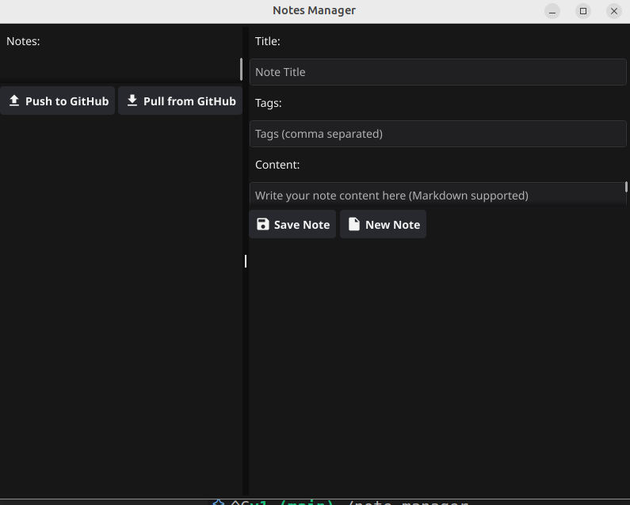

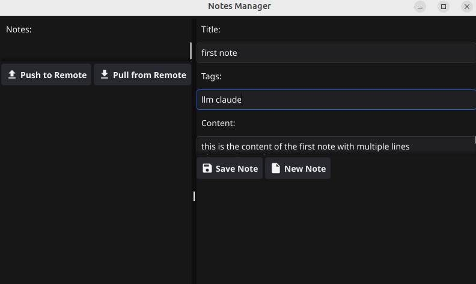

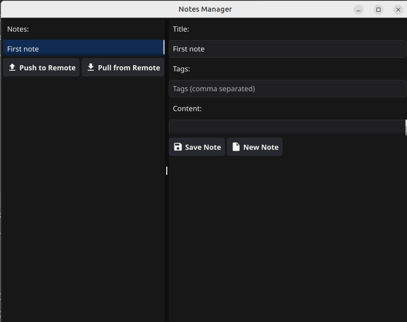

</details>

## Fix UI

The field to enter the note context should display multiple lines and have a scroll bar


### Claude response

I see the issue. The note content entry field should be larger and have scrollbars to handle larger content blocks. The current implementation uses a widget.NewMultiLineEntry(), but we need to ensure it's properly configured within a scrollable container and has appropriate sizing. Let me fix that:

<details>

<summary> Go Note-Taking App with Git Integration </summary>

```go
package main

import (
	"bufio"
	"fmt"
	"io/ioutil"
	"os"
	"path/filepath"
	"strings"
	"time"

	"fyne.io/fyne/v2"
	"fyne.io/fyne/v2/app"
	"fyne.io/fyne/v2/container"
	"fyne.io/fyne/v2/dialog"
	"fyne.io/fyne/v2/layout"
	"fyne.io/fyne/v2/theme"
	"fyne.io/fyne/v2/widget"
	"github.com/go-git/go-git/v5"
	"github.com/go-git/go-git/v5/plumbing/object"
	"github.com/go-git/go-git/v5/plumbing/transport"
)

type Note struct {
	Title   string
	Tags    []string
	Content string
	Created time.Time
}

type AppConfig struct {
	RepoPath string
}

// ensureRepoExists checks if the repo exists and is a git repo
func ensureRepoExists(path string) (*git.Repository, error) {
	if _, err := os.Stat(path); os.IsNotExist(err) {
		// Create directory
		if err := os.MkdirAll(path, 0755); err != nil {
			return nil, fmt.Errorf("failed to create directory: %v", err)
		}
		
		// Initialize git repository
		repo, err := git.PlainInit(path, false)
		if err != nil {
			return nil, fmt.Errorf("failed to initialize git repository: %v", err)
		}
		
		return repo, nil
	}
	
	// Open existing repository
	repo, err := git.PlainOpen(path)
	if err != nil {
		return nil, fmt.Errorf("not a valid git repository: %v", err)
	}
	
	return repo, nil
}

// saveNote saves a note to the repository
func saveNote(note Note, repo *git.Repository, repoPath string) error {
	// Format the filename: YYYY-MM-DD-title.md
	fileName := fmt.Sprintf("%04d-%02d-%02d-%s.md", 
		note.Created.Year(), 
		note.Created.Month(), 
		note.Created.Day(), 
		strings.ReplaceAll(note.Title, " ", "-"))
	
	// Create the file content
	content := fmt.Sprintf("# %s\n\nTags: %s\n\n%s", 
		note.Title, 
		strings.Join(note.Tags, ", "), 
		note.Content)
	
	// Write to file
	filePath := filepath.Join(repoPath, fileName)
	if err := ioutil.WriteFile(filePath, []byte(content), 0644); err != nil {
		return fmt.Errorf("failed to write file: %v", err)
	}
	
	// Get the worktree
	w, err := repo.Worktree()
	if err != nil {
		return fmt.Errorf("failed to get worktree: %v", err)
	}
	
	// Add file to git
	_, err = w.Add(fileName)
	if err != nil {
		return fmt.Errorf("git add failed: %v", err)
	}
	
	// Commit changes
	commitMsg := fmt.Sprintf("Add note: %s", note.Title)
	_, err = w.Commit(commitMsg, &git.CommitOptions{
		Author: &object.Signature{
			Name:  "Notes App",
			Email: "notes@example.com",
			When:  time.Now(),
		},
	})
	if err != nil {
		return fmt.Errorf("git commit failed: %v", err)
	}
	
	return nil
}

// listNotes retrieves all notes from the repository
func listNotes(repoPath string) ([]Note, error) {
	var notes []Note
	
	// Get all .md files
	files, err := filepath.Glob(filepath.Join(repoPath, "*.md"))
	if err != nil {
		return nil, fmt.Errorf("failed to list files: %v", err)
	}
	
	for _, file := range files {
		content, err := ioutil.ReadFile(file)
		if err != nil {
			continue
		}
		
		// Parse note from file
		note, err := parseNoteFromContent(content, filepath.Base(file))
		if err != nil {
			continue
		}
		
		notes = append(notes, note)
	}
	
	return notes, nil
}

// parseNoteFromContent extracts note data from file content
func parseNoteFromContent(content []byte, filename string) (Note, error) {
	var note Note
	
	// Parse creation date and title from filename (YYYY-MM-DD-title.md)
	parts := strings.Split(filename, "-")
	if len(parts) < 4 {
		return note, fmt.Errorf("invalid filename format")
	}
	
	year := parts[0]
	month := parts[1]
	day := parts[2]
	
	// Extract title (join remaining parts and remove .md)
	titleParts := parts[3:]
	title := strings.Join(titleParts, "-")
	title = strings.TrimSuffix(title, ".md")
	title = strings.ReplaceAll(title, "-", " ")
	
	// Parse date
	dateStr := fmt.Sprintf("%s-%s-%s", year, month, day)
	created, err := time.Parse("2006-01-02", dateStr)
	if err != nil {
		return note, fmt.Errorf("invalid date format: %v", err)
	}
	
	// Parse content
	contentStr := string(content)
	scanner := bufio.NewScanner(strings.NewReader(contentStr))
	
	// First line should be title
	if scanner.Scan() {
		titleLine := scanner.Text()
		if strings.HasPrefix(titleLine, "# ") {
			note.Title = strings.TrimPrefix(titleLine, "# ")
		}
	}
	
	// Look for tags
	var contentBuilder strings.Builder
	foundTags := false
	
	for scanner.Scan() {
		line := scanner.Text()
		
		if !foundTags && strings.HasPrefix(line, "Tags: ") {
			tagsStr := strings.TrimPrefix(line, "Tags: ")
			tags := strings.Split(tagsStr, ", ")
			note.Tags = tags
			foundTags = true
			continue
		}
		
		// Add to content
		contentBuilder.WriteString(line)
		contentBuilder.WriteString("\n")
	}
	
	note.Content = contentBuilder.String()
	note.Created = created
	
	if note.Title == "" {
		note.Title = title // Use filename-derived title if not found in content
	}
	
	return note, nil
}

// pushToRemote pushes changes to remote repository
func pushToRemote(repo *git.Repository) error {
	// Push using go-git
	err := repo.Push(&git.PushOptions{
		RemoteName: "origin",
		Progress:   os.Stdout,
	})
	
	if err != nil && err != transport.ErrEmptyRemoteRepository {
		return fmt.Errorf("git push failed: %v", err)
	}
	
	return nil
}

// pullFromRemote pulls changes from remote repository
func pullFromRemote(repo *git.Repository) error {
	w, err := repo.Worktree()
	if err != nil {
		return fmt.Errorf("failed to get worktree: %v", err)
	}
	
	err = w.Pull(&git.PullOptions{
		RemoteName: "origin",
		Progress:   os.Stdout,
	})
	
	if err != nil && err != git.NoErrAlreadyUpToDate {
		return fmt.Errorf("git pull failed: %v", err)
	}
	
	return nil
}

func main() {
	// Configuration
	homeDir, _ := os.UserHomeDir()
	config := AppConfig{
		RepoPath: filepath.Join(homeDir, "notes-repo"),
	}
	
	// Ensure repository exists
	repo, err := ensureRepoExists(config.RepoPath)
	if err != nil {
		fmt.Printf("Error initializing repository: %v\n", err)
		os.Exit(1)
	}
	
	// Create Fyne app
	a := app.New()
	a.Settings().SetTheme(theme.DarkTheme())
	w := a.NewWindow("Notes Manager")
	w.Resize(fyne.NewSize(900, 700))
	
	// UI elements
	titleEntry := widget.NewEntry()
	titleEntry.SetPlaceHolder("Note Title")
	
	tagsEntry := widget.NewEntry()
	tagsEntry.SetPlaceHolder("Tags (comma separated)")
	
	// Create multiline content entry with proper scrolling
	contentEntry := widget.NewMultiLineEntry()
	contentEntry.SetPlaceHolder("Write your note content here (Markdown supported)")
	contentEntry.Wrapping = fyne.TextWrapWord  // Enable word wrapping
	
	// Content entry should take up all available space
	contentEntryScroll := container.NewScroll(contentEntry)
	contentEntryScroll.SetMinSize(fyne.NewSize(500, 400))  // Set minimum size for content area
	
	notesList := widget.NewList(
		func() int { return 0 }, // Will be updated when we load notes
		func() fyne.CanvasObject {
			return widget.NewLabel("Note Title")
		},
		func(id widget.ListItemID, obj fyne.CanvasObject) {
			// Will be updated when we load notes
		},
	)
	
	// Load notes initially
	var notes []Note
	
	refreshNotesList := func() {
		notes, err = listNotes(config.RepoPath)
		if err != nil {
			dialog.ShowError(err, w)
			return
		}
		
		notesList.Length = func() int {
			return len(notes)
		}
		
		notesList.UpdateItem = func(id widget.ListItemID, obj fyne.CanvasObject) {
			label := obj.(*widget.Label)
			if id < len(notes) {
				label.SetText(notes[id].Title)
			}
		}
		
		notesList.Refresh()
	}
	
	// Buttons
	saveButton := widget.NewButtonWithIcon("Save Note", theme.DocumentSaveIcon(), func() {
		if titleEntry.Text == "" {
			dialog.ShowInformation("Error", "Title cannot be empty", w)
			return
		}
		
		// Create note
		note := Note{
			Title:   titleEntry.Text,
			Content: contentEntry.Text,
			Created: time.Now(),
		}
		
		// Parse tags
		if tagsEntry.Text != "" {
			tagsList := strings.Split(tagsEntry.Text, ",")
			for i, tag := range tagsList {
				tagsList[i] = strings.TrimSpace(tag)
			}
			note.Tags = tagsList
		}
		
		// Save note
		if err := saveNote(note, repo, config.RepoPath); err != nil {
			dialog.ShowError(err, w)
			return
		}
		
		// Clear fields
		titleEntry.SetText("")
		tagsEntry.SetText("")
		contentEntry.SetText("")
		
		// Refresh list
		refreshNotesList()
		
		dialog.ShowInformation("Success", "Note saved successfully", w)
	})
	
	pushButton := widget.NewButtonWithIcon("Push to Remote", theme.UploadIcon(), func() {
		// Push to remote repository
		if err := pushToRemote(repo); err != nil {
			dialog.ShowError(err, w)
			return
		}
		
		dialog.ShowInformation("Success", "Changes pushed to remote repository", w)
	})
	
	pullButton := widget.NewButtonWithIcon("Pull from Remote", theme.DownloadIcon(), func() {
		// Pull from remote repository
		if err := pullFromRemote(repo); err != nil {
			dialog.ShowError(err, w)
			return
		}
		
		// Refresh list
		refreshNotesList()
		
		dialog.ShowInformation("Success", "Changes pulled from remote repository", w)
	})
	
	newButton := widget.NewButtonWithIcon("New Note", theme.FileIcon(), func() {
		// Clear fields
		titleEntry.SetText("")
		tagsEntry.SetText("")
		contentEntry.SetText("")
	})
	
	// Note selection handling
	notesList.OnSelected = func(id widget.ListItemID) {
		if id < len(notes) {
			selectedNote := notes[id]
			titleEntry.SetText(selectedNote.Title)
			tagsEntry.SetText(strings.Join(selectedNote.Tags, ", "))
			contentEntry.SetText(selectedNote.Content)
		}
	}
	
	// Layout
	// Create a form layout for title and tags
	formContainer := container.NewVBox(
		widget.NewLabel("Title:"),
		titleEntry,
		widget.NewLabel("Tags:"),
		tagsEntry,
	)
	
	// Content area with label
	contentContainer := container.NewVBox(
		widget.NewLabel("Content:"),
		contentEntryScroll,  // Use the scrollable container
	)
	
	// Buttons container
	buttonContainer := container.NewHBox(
		saveButton,
		newButton,
	)
	
	// Stack everything in the editor area
	editorContainer := container.NewBorder(
		formContainer,  // Top
		buttonContainer, // Bottom
		nil,            // Left
		nil,            // Right
		contentContainer // Center (fills remaining space)
	)
	
	// List container with fixed width
	listContainer := container.NewVBox(
		widget.NewLabel("Notes:"),
		container.NewScroll(notesList),
		container.NewHBox(
			pushButton,
			pullButton,
		),
	)
	
	// Set minimum size for list container
	listScroll := container.NewScroll(listContainer)
	listScroll.SetMinSize(fyne.NewSize(200, 0))
	
	// Split view
	split := container.NewHSplit(
		listScroll,
		editorContainer,
	)
	split.SetOffset(0.25) // 25% for list, 75% for editor
	
	// Set main container
	w.SetContent(container.New(layout.NewMaxLayout(), split))
	
	// Initial refresh
	refreshNotesList()
	
	// Show and run
	w.ShowAndRun()
}
```

</details>


I've made several improvements to enhance the content entry field and overall UI layout:

1. Improved the content entry field:
* Added proper word wrapping with contentEntry.Wrapping = fyne.TextWrapWord
* Placed the content entry inside a dedicated scroll container
* Set a minimum size for the content area (500x400) to ensure it's large enough for editing
* Increased the window size to 900x700 pixels for a better overall experience
2. Better layout organization:
* Used a Border layout for the editor area, which allows the content to fill all available space
* Separated the form fields (title/tags) from the content for better visual organization
* Placed the buttons at the bottom of the editor container
* Used a fixed minimum width (200px) for the notes list
3. UI enhancements:
* Adjusted the split offset to 25% for the list, 75% for the editor
* Added a scroll container for the list panel to handle many notes
* Used consistent containers with proper padding

These changes should provide a much better editing experience with the content field now having proper scrolling and taking up most of the available space. The UI is also more organized with a clearer visual hierarchy.


<details>

<summary> screenshots (click to expand) </summary>

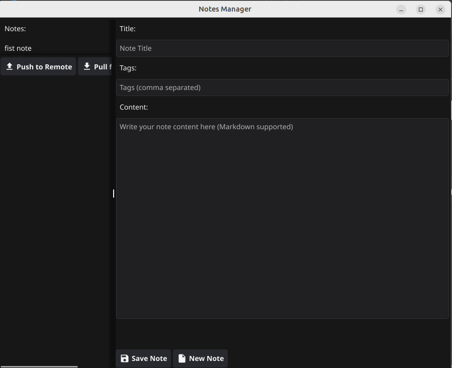

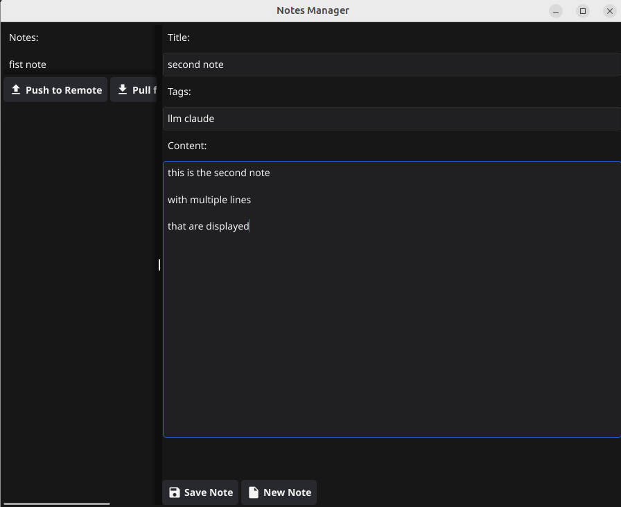

</details>


## fix note list is not updated

> At this point the chat could not handle more context and I had to start a new chat pasting the code of the application


This is an application that takes notes and save them in a git repository. 

The user interface has an issue: the list of notes is not updated after a note is added

### claude response

I've reviewed the code and see the issue with the list of notes not updating properly after a note is added. Let me analyze the problem and provide a solution.

The issue is in the refreshNotesList function. Here's what's happening:

When the app loads, the refreshNotesList function is called once to initially populate the list.
This function sets up the Length and UpdateItem functions for the notesList widget and calls notesList.Refresh().
When a note is saved, the function is called again to refresh the list, but there's a problem with how the list is being updated.
The main issue is that while you're updating the notes slice correctly with the new notes from the repository, and you're setting the Length and UpdateItem functions properly, there's no explicit mechanism to tell the list that its data has changed significantly (beyond just refreshing the UI).

Here's a fix for this issue:

<details>
<summary> Fixed Notes List Update (click to expand) </summary>

```go
func main() {
	// Configuration
	homeDir, _ := os.UserHomeDir()
	config := AppConfig{
	    RepoPath: filepath.Join(homeDir, "notes-repo"),
	}
	
	// Ensure repository exists
	repo, err := ensureRepoExists(config.RepoPath)
	if err != nil {
	    fmt.Printf("Error initializing repository: %v\n", err)
	    os.Exit(1)
	}
	
	// Create Fyne app
	a := app.New()
	a.Settings().SetTheme(theme.DarkTheme())
	w := a.NewWindow("Notes Manager")
	w.Resize(fyne.NewSize(900, 700))
	
	// UI elements
	titleEntry := widget.NewEntry()
	titleEntry.SetPlaceHolder("Note Title")
	
	tagsEntry := widget.NewEntry()
	tagsEntry.SetPlaceHolder("Tags (comma separated)")
	
	// Create multiline content entry with proper scrolling
	contentEntry := widget.NewMultiLineEntry()
	contentEntry.SetPlaceHolder("Write your note content here (Markdown supported)")
	contentEntry.Wrapping = fyne.TextWrapWord  // Enable word wrapping
	
	// Content entry should take up all available space
	contentEntryScroll := container.NewScroll(contentEntry)
	contentEntryScroll.SetMinSize(fyne.NewSize(500, 400))  // Set minimum size for content area
	
	// Initialize notes slice
	var notes []Note
	
	// Create list widget with proper binding to notes slice
	notesList := widget.NewList(
	    func() int { 
		return len(notes) // This will update when notes slice changes
	    },
	    func() fyne.CanvasObject {
		return widget.NewLabel("Note Title")
	    },
	    func(id widget.ListItemID, obj fyne.CanvasObject) {
		label := obj.(*widget.Label)
		if id < len(notes) {
		    label.SetText(notes[id].Title)
		}
	    },
	)
	
	// Function to refresh the notes list
	refreshNotesList := func() {
	    var err error
	    notes, err = listNotes(config.RepoPath)
	    if err != nil {
		dialog.ShowError(err, w)
		return
	    }
	    
	    // This is the key change - fully refresh the list widget
	    notesList.Refresh()
	}
	
	// Buttons
	saveButton := widget.NewButtonWithIcon("Save Note", theme.DocumentSaveIcon(), func() {
	    if titleEntry.Text == "" {
		dialog.ShowInformation("Error", "Title cannot be empty", w)
		return
	    }
	    
	    // Create note
	    note := Note{
		Title:   titleEntry.Text,
		Content: contentEntry.Text,
		Created: time.Now(),
	    }
	    
	    // Parse tags
	    if tagsEntry.Text != "" {
		tagsList := strings.Split(tagsEntry.Text, ",")
		for i, tag := range tagsList {
		    tagsList[i] = strings.TrimSpace(tag)
		}
		note.Tags = tagsList
	    }
	    
	    // Save note
	    if err := saveNote(note, repo, config.RepoPath); err != nil {
		dialog.ShowError(err, w)
		return
	    }
	    
	    // Clear fields
	    titleEntry.SetText("")
	    tagsEntry.SetText("")
	    contentEntry.SetText("")
	    
	    // Refresh list
	    refreshNotesList()
	    
	    dialog.ShowInformation("Success", "Note saved successfully", w)
	})
	
	pushButton := widget.NewButtonWithIcon("Push to Remote", theme.UploadIcon(), func() {
	    // Push to remote repository
	    if err := pushToRemote(repo); err != nil {
		dialog.ShowError(err, w)
		return
	    }
	    
	    dialog.ShowInformation("Success", "Changes pushed to remote repository", w)
	})
	
	pullButton := widget.NewButtonWithIcon("Pull from Remote", theme.DownloadIcon(), func() {
	    // Pull from remote repository
	    if err := pullFromRemote(repo); err != nil {
		dialog.ShowError(err, w)
		return
	    }
	    
	    // Refresh list
	    refreshNotesList()
	    
	    dialog.ShowInformation("Success", "Changes pulled from remote repository", w)
	})
	
	newButton := widget.NewButtonWithIcon("New Note", theme.FileIcon(), func() {
	    // Clear fields
	    titleEntry.SetText("")
	    tagsEntry.SetText("")
	    contentEntry.SetText("")
	})
	
	// Note selection handling
	notesList.OnSelected = func(id widget.ListItemID) {
	    if id < len(notes) {
		selectedNote := notes[id]
		titleEntry.SetText(selectedNote.Title)
		tagsEntry.SetText(strings.Join(selectedNote.Tags, ", "))
		contentEntry.SetText(selectedNote.Content)
	    }
	}
	
	// Layout
	// Create a form layout for title and tags
	formContainer := container.NewVBox(
	    widget.NewLabel("Title:"),
	    titleEntry,
	    widget.NewLabel("Tags:"),
	    tagsEntry,
	)
	
	// Content area with label
	contentContainer := container.NewVBox(
	    widget.NewLabel("Content:"),
	    contentEntryScroll,  // Use the scrollable container
	)
	
	// Buttons container
	buttonContainer := container.NewHBox(
	    saveButton,
	    newButton,
	)
	
	// Stack everything in the editor area
	editorContainer := container.NewBorder(
	    formContainer,  // Top
	    buttonContainer, // Bottom
	    nil,            // Left
	    nil,            // Right
	    contentContainer, // Center (fills remaining space)
	)
	
	// List container with fixed width
	listContainer := container.NewVBox(
	    widget.NewLabel("Notes:"),
	    container.NewScroll(notesList),
	    container.NewHBox(
		pushButton,
		pullButton,
	    ),
	)
	
	// Set minimum size for list container
	listScroll := container.NewScroll(listContainer)
	listScroll.SetMinSize(fyne.NewSize(200, 0))
	
	// Split view
	split := container.NewHSplit(
	    listScroll,
	    editorContainer,
	)
	split.SetOffset(0.25) // 25% for list, 75% for editor
	
	// Set main container
	w.SetContent(container.New(layout.NewMaxLayout(), split))
	
	// Initial refresh
	refreshNotesList()
	
	// Show and run
	w.ShowAndRun()
    }
```

</details>

The key changes I made:

1. Modified the initial definition of the notesList widget to:
* Directly use len(notes) for the list length function
* Keep the item creation and update functions consistent
* Simplified the refreshNotesList function to:
* Update the notes slice with the latest data from the repository
2. Simply call notesList.Refresh() to refresh the widget

The core issue was that the original code was redefining the Length and UpdateItem functions every time refreshNotesList was called, but the list widget wasn't always picking up these changes correctly. By defining these functions at initialization to directly reference the notes slice, and then just updating the notes slice in the refresh function, we ensure that the list will always be synchronized with the current notes data.

This change ensures that the list of notes will properly update whenever a new note is added or when notes are pulled from the remote repository.

## Fix compilation error

this code does not compile missing package

### Claude response 


I apologize for the error. You're right - the code won't compile because I didn't include the full program, just the main() function. Let me provide a complete version of the fixed program that will compile properly.

<details>
<summary> Complete Fixed Notes App </summary>

```go
package main

import (
	"bufio"
	"fmt"
	"io/ioutil"
	"os"
	"path/filepath"
	"strings"
	"time"

	"fyne.io/fyne/v2"
	"fyne.io/fyne/v2/app"
	"fyne.io/fyne/v2/container"
	"fyne.io/fyne/v2/dialog"
	"fyne.io/fyne/v2/layout"
	"fyne.io/fyne/v2/theme"
	"fyne.io/fyne/v2/widget"
	"github.com/go-git/go-git/v5"
	"github.com/go-git/go-git/v5/plumbing/object"
	"github.com/go-git/go-git/v5/plumbing/transport"
)

type Note struct {
	Title   string
	Tags    []string
	Content string
	Created time.Time
}

type AppConfig struct {
	RepoPath string
}

// ensureRepoExists checks if the repo exists and is a git repo
func ensureRepoExists(path string) (*git.Repository, error) {
	if _, err := os.Stat(path); os.IsNotExist(err) {
		// Create directory
		if err := os.MkdirAll(path, 0755); err != nil {
			return nil, fmt.Errorf("failed to create directory: %v", err)
		}
		
		// Initialize git repository
		repo, err := git.PlainInit(path, false)
		if err != nil {
			return nil, fmt.Errorf("failed to initialize git repository: %v", err)
		}
		
		return repo, nil
	}
	
	// Open existing repository
	repo, err := git.PlainOpen(path)
	if err != nil {
		return nil, fmt.Errorf("not a valid git repository: %v", err)
	}
	
	return repo, nil
}

// saveNote saves a note to the repository
func saveNote(note Note, repo *git.Repository, repoPath string) error {
	// Format the filename: YYYY-MM-DD-title.md
	fileName := fmt.Sprintf("%04d-%02d-%02d-%s.md", 
		note.Created.Year(), 
		note.Created.Month(), 
		note.Created.Day(), 
		strings.ReplaceAll(note.Title, " ", "-"))
	
	// Create the file content
	content := fmt.Sprintf("# %s\n\nTags: %s\n\n%s", 
		note.Title, 
		strings.Join(note.Tags, ", "), 
		note.Content)
	
	// Write to file
	filePath := filepath.Join(repoPath, fileName)
	if err := ioutil.WriteFile(filePath, []byte(content), 0644); err != nil {
		return fmt.Errorf("failed to write file: %v", err)
	}
	
	// Get the worktree
	w, err := repo.Worktree()
	if err != nil {
		return fmt.Errorf("failed to get worktree: %v", err)
	}
	
	// Add file to git
	_, err = w.Add(fileName)
	if err != nil {
		return fmt.Errorf("git add failed: %v", err)
	}
	
	// Commit changes
	commitMsg := fmt.Sprintf("Add note: %s", note.Title)
	_, err = w.Commit(commitMsg, &git.CommitOptions{
		Author: &object.Signature{
			Name:  "Notes App",
			Email: "notes@example.com",
			When:  time.Now(),
		},
	})
	if err != nil {
		return fmt.Errorf("git commit failed: %v", err)
	}
	
	return nil
}

// listNotes retrieves all notes from the repository
func listNotes(repoPath string) ([]Note, error) {
	var notes []Note
	
	// Get all .md files
	files, err := filepath.Glob(filepath.Join(repoPath, "*.md"))
	if err != nil {
		return nil, fmt.Errorf("failed to list files: %v", err)
	}
	
	for _, file := range files {
		content, err := ioutil.ReadFile(file)
		if err != nil {
			continue
		}
		
		// Parse note from file
		note, err := parseNoteFromContent(content, filepath.Base(file))
		if err != nil {
			continue
		}
		
		notes = append(notes, note)
	}
	
	return notes, nil
}

// parseNoteFromContent extracts note data from file content
func parseNoteFromContent(content []byte, filename string) (Note, error) {
	var note Note
	
	// Parse creation date and title from filename (YYYY-MM-DD-title.md)
	parts := strings.Split(filename, "-")
	if len(parts) < 4 {
		return note, fmt.Errorf("invalid filename format")
	}
	
	year := parts[0]
	month := parts[1]
	day := parts[2]
	
	// Extract title (join remaining parts and remove .md)
	titleParts := parts[3:]
	title := strings.Join(titleParts, "-")
	title = strings.TrimSuffix(title, ".md")
	title = strings.ReplaceAll(title, "-", " ")
	
	// Parse date
	dateStr := fmt.Sprintf("%s-%s-%s", year, month, day)
	created, err := time.Parse("2006-01-02", dateStr)
	if err != nil {
		return note, fmt.Errorf("invalid date format: %v", err)
	}
	
	// Parse content
	contentStr := string(content)
	scanner := bufio.NewScanner(strings.NewReader(contentStr))
	
	// First line should be title
	if scanner.Scan() {
		titleLine := scanner.Text()
		if strings.HasPrefix(titleLine, "# ") {
			note.Title = strings.TrimPrefix(titleLine, "# ")
		}
	}
	
	// Look for tags
	var contentBuilder strings.Builder
	foundTags := false
	
	for scanner.Scan() {
		line := scanner.Text()
		
		if !foundTags && strings.HasPrefix(line, "Tags: ") {
			tagsStr := strings.TrimPrefix(line, "Tags: ")
			tags := strings.Split(tagsStr, ", ")
			note.Tags = tags
			foundTags = true
			continue
		}
		
		// Add to content
		contentBuilder.WriteString(line)
		contentBuilder.WriteString("\n")
	}
	
	note.Content = contentBuilder.String()
	note.Created = created
	
	if note.Title == "" {
		note.Title = title // Use filename-derived title if not found in content
	}
	
	return note, nil
}

// pushToRemote pushes changes to remote repository
func pushToRemote(repo *git.Repository) error {
	// Push using go-git
	err := repo.Push(&git.PushOptions{
		RemoteName: "origin",
		Progress:   os.Stdout,
	})
	
	if err != nil && err != transport.ErrEmptyRemoteRepository {
		return fmt.Errorf("git push failed: %v", err)
	}
	
	return nil
}

// pullFromRemote pulls changes from remote repository
func pullFromRemote(repo *git.Repository) error {
	w, err := repo.Worktree()
	if err != nil {
		return fmt.Errorf("failed to get worktree: %v", err)
	}
	
	err = w.Pull(&git.PullOptions{
		RemoteName: "origin",
		Progress:   os.Stdout,
	})
	
	if err != nil && err != git.NoErrAlreadyUpToDate {
		return fmt.Errorf("git pull failed: %v", err)
	}
	
	return nil
}

func main() {
	// Configuration
	homeDir, _ := os.UserHomeDir()
	config := AppConfig{
		RepoPath: filepath.Join(homeDir, "notes-repo"),
	}
	
	// Ensure repository exists
	repo, err := ensureRepoExists(config.RepoPath)
	if err != nil {
		fmt.Printf("Error initializing repository: %v\n", err)
		os.Exit(1)
	}
	
	// Create Fyne app
	a := app.New()
	a.Settings().SetTheme(theme.DarkTheme())
	w := a.NewWindow("Notes Manager")
	w.Resize(fyne.NewSize(900, 700))
	
	// UI elements
	titleEntry := widget.NewEntry()
	titleEntry.SetPlaceHolder("Note Title")
	
	tagsEntry := widget.NewEntry()
	tagsEntry.SetPlaceHolder("Tags (comma separated)")
	
	// Create multiline content entry with proper scrolling
	contentEntry := widget.NewMultiLineEntry()
	contentEntry.SetPlaceHolder("Write your note content here (Markdown supported)")
	contentEntry.Wrapping = fyne.TextWrapWord  // Enable word wrapping
	
	// Content entry should take up all available space
	contentEntryScroll := container.NewScroll(contentEntry)
	contentEntryScroll.SetMinSize(fyne.NewSize(500, 400))  // Set minimum size for content area
	
	// Initialize notes slice
	var notes []Note
	
	// Create list widget with proper binding to notes slice
	notesList := widget.NewList(
		func() int { 
			return len(notes) // This will update when notes slice changes
		},
		func() fyne.CanvasObject {
			return widget.NewLabel("Note Title")
		},
		func(id widget.ListItemID, obj fyne.CanvasObject) {
			label := obj.(*widget.Label)
			if id < len(notes) {
				label.SetText(notes[id].Title)
			}
		},
	)
	
	// Function to refresh the notes list
	refreshNotesList := func() {
		var err error
		notes, err = listNotes(config.RepoPath)
		if err != nil {
			dialog.ShowError(err, w)
			return
		}
		
		// This is the key change - fully refresh the list widget
		notesList.Refresh()
	}
	
	// Buttons
	saveButton := widget.NewButtonWithIcon("Save Note", theme.DocumentSaveIcon(), func() {
		if titleEntry.Text == "" {
			dialog.ShowInformation("Error", "Title cannot be empty", w)
			return
		}
		
		// Create note
		note := Note{
			Title:   titleEntry.Text,
			Content: contentEntry.Text,
			Created: time.Now(),
		}
		
		// Parse tags
		if tagsEntry.Text != "" {
			tagsList := strings.Split(tagsEntry.Text, ",")
			for i, tag := range tagsList {
				tagsList[i] = strings.TrimSpace(tag)
			}
			note.Tags = tagsList
		}
		
		// Save note
		if err := saveNote(note, repo, config.RepoPath); err != nil {
			dialog.ShowError(err, w)
			return
		}
		
		// Clear fields
		titleEntry.SetText("")
		tagsEntry.SetText("")
		contentEntry.SetText("")
		
		// Refresh list
		refreshNotesList()
		
		dialog.ShowInformation("Success", "Note saved successfully", w)
	})
	
	pushButton := widget.NewButtonWithIcon("Push to Remote", theme.UploadIcon(), func() {
		// Push to remote repository
		if err := pushToRemote(repo); err != nil {
			dialog.ShowError(err, w)
			return
		}
		
		dialog.ShowInformation("Success", "Changes pushed to remote repository", w)
	})
	
	pullButton := widget.NewButtonWithIcon("Pull from Remote", theme.DownloadIcon(), func() {
		// Pull from remote repository
		if err := pullFromRemote(repo); err != nil {
			dialog.ShowError(err, w)
			return
		}
		
		// Refresh list
		refreshNotesList()
		
		dialog.ShowInformation("Success", "Changes pulled from remote repository", w)
	})
	
	newButton := widget.NewButtonWithIcon("New Note", theme.FileIcon(), func() {
		// Clear fields
		titleEntry.SetText("")
		tagsEntry.SetText("")
		contentEntry.SetText("")
	})
	
	// Note selection handling
	notesList.OnSelected = func(id widget.ListItemID) {
		if id < len(notes) {
			selectedNote := notes[id]
			titleEntry.SetText(selectedNote.Title)
			tagsEntry.SetText(strings.Join(selectedNote.Tags, ", "))
			contentEntry.SetText(selectedNote.Content)
		}
	}
	
	// Layout
	// Create a form layout for title and tags
	formContainer := container.NewVBox(
		widget.NewLabel("Title:"),
		titleEntry,
		widget.NewLabel("Tags:"),
		tagsEntry,
	)
	
	// Content area with label
	contentContainer := container.NewVBox(
		widget.NewLabel("Content:"),
		contentEntryScroll,  // Use the scrollable container
	)
	
	// Buttons container
	buttonContainer := container.NewHBox(
		saveButton,
		newButton,
	)
	
	// Stack everything in the editor area
	editorContainer := container.NewBorder(
		formContainer,  // Top
		buttonContainer, // Bottom
		nil,            // Left
		nil,            // Right
		contentContainer, // Center (fills remaining space)
	)
	
	// List container with fixed width
	listContainer := container.NewVBox(
		widget.NewLabel("Notes:"),
		container.NewScroll(notesList),
		container.NewHBox(
			pushButton,
			pullButton,
		),
	)
	
	// Set minimum size for list container
	listScroll := container.NewScroll(listContainer)
	listScroll.SetMinSize(fyne.NewSize(200, 0))
	
	// Split view
	split := container.NewHSplit(
		listScroll,
		editorContainer,
	)
	split.SetOffset(0.25) // 25% for list, 75% for editor
	
	// Set main container
	w.SetContent(container.New(layout.NewMaxLayout(), split))
	
	// Initial refresh
	refreshNotesList()
	
	// Show and run
	w.ShowAndRun()
}

```

</details>

The key changes from the original code are:

1. Changed the notesList widget definition to directly refer to the len(notes) for its Length function instead of initially returning 0 and then being redefined later.
2. Simplified the refreshNotesList function to only:
* Update the notes slice from the filesystem
* Call notesList.Refresh() to update the UI

The previous approach was redefining the Length and UpdateItem functions every time the list was refreshed, but the correct approach is to have these functions always reference the current state of the notes slice, and then just update that slice and call Refresh() when the data changes.

This should now properly update the list after adding a new note, and the code should compile successfully.

<details>

<summary> screenshots (click to expand) </summary>

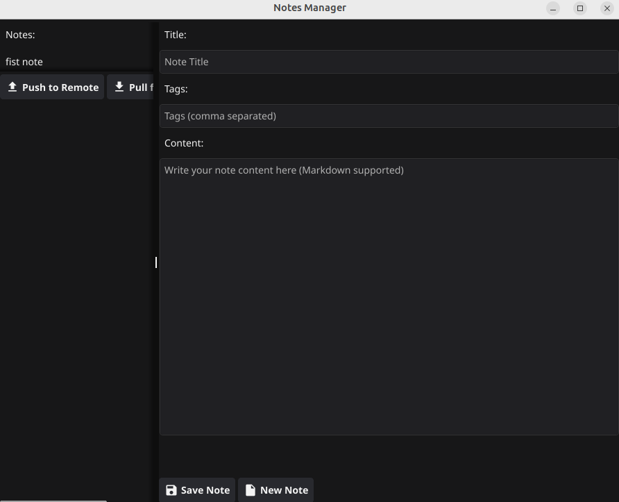

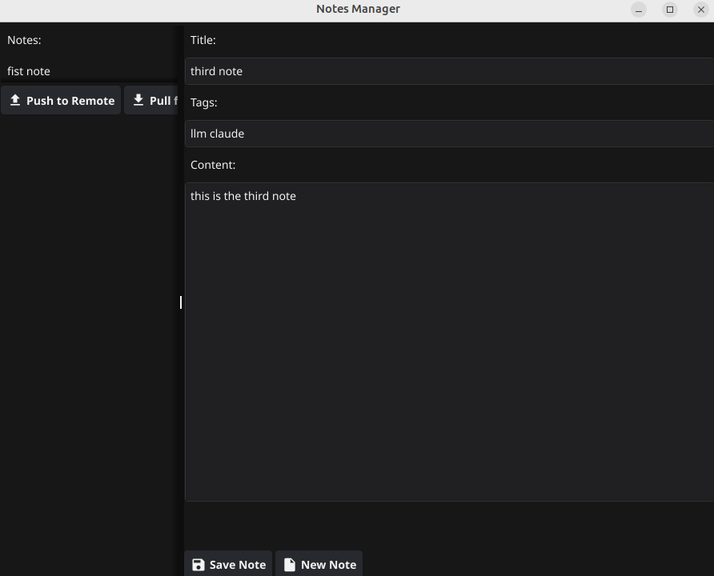

</details>

## Fix list of notes size

The list of notes is too smail. It only shows a note. use the full space of the left panel to display the list of notes

### Claude response

You're right - the list of notes is currently too constrained in the interface. Let me improve the layout to ensure the notes list uses the full space of the left panel.

<details>

<summary> Notes App with Improved List Layout </summary>

```go
package main

import (
	"bufio"
	"fmt"
	"io/ioutil"
	"os"
	"path/filepath"
	"strings"
	"time"

	"fyne.io/fyne/v2"
	"fyne.io/fyne/v2/app"
	"fyne.io/fyne/v2/container"
	"fyne.io/fyne/v2/dialog"
	"fyne.io/fyne/v2/layout"
	"fyne.io/fyne/v2/theme"
	"fyne.io/fyne/v2/widget"
	"github.com/go-git/go-git/v5"
	"github.com/go-git/go-git/v5/plumbing/object"
	"github.com/go-git/go-git/v5/plumbing/transport"
)

type Note struct {
	Title   string
	Tags    []string
	Content string
	Created time.Time
}

type AppConfig struct {
	RepoPath string
}

// ensureRepoExists checks if the repo exists and is a git repo
func ensureRepoExists(path string) (*git.Repository, error) {
	if _, err := os.Stat(path); os.IsNotExist(err) {
		// Create directory
		if err := os.MkdirAll(path, 0755); err != nil {
			return nil, fmt.Errorf("failed to create directory: %v", err)
		}
		
		// Initialize git repository
		repo, err := git.PlainInit(path, false)
		if err != nil {
			return nil, fmt.Errorf("failed to initialize git repository: %v", err)
		}
		
		return repo, nil
	}
	
	// Open existing repository
	repo, err := git.PlainOpen(path)
	if err != nil {
		return nil, fmt.Errorf("not a valid git repository: %v", err)
	}
	
	return repo, nil
}

// saveNote saves a note to the repository
func saveNote(note Note, repo *git.Repository, repoPath string) error {
	// Format the filename: YYYY-MM-DD-title.md
	fileName := fmt.Sprintf("%04d-%02d-%02d-%s.md", 
		note.Created.Year(), 
		note.Created.Month(), 
		note.Created.Day(), 
		strings.ReplaceAll(note.Title, " ", "-"))
	
	// Create the file content
	content := fmt.Sprintf("# %s\n\nTags: %s\n\n%s", 
		note.Title, 
		strings.Join(note.Tags, ", "), 
		note.Content)
	
	// Write to file
	filePath := filepath.Join(repoPath, fileName)
	if err := ioutil.WriteFile(filePath, []byte(content), 0644); err != nil {
		return fmt.Errorf("failed to write file: %v", err)
	}
	
	// Get the worktree
	w, err := repo.Worktree()
	if err != nil {
		return fmt.Errorf("failed to get worktree: %v", err)
	}
	
	// Add file to git
	_, err = w.Add(fileName)
	if err != nil {
		return fmt.Errorf("git add failed: %v", err)
	}
	
	// Commit changes
	commitMsg := fmt.Sprintf("Add note: %s", note.Title)
	_, err = w.Commit(commitMsg, &git.CommitOptions{
		Author: &object.Signature{
			Name:  "Notes App",
			Email: "notes@example.com",
			When:  time.Now(),
		},
	})
	if err != nil {
		return fmt.Errorf("git commit failed: %v", err)
	}
	
	return nil
}

// listNotes retrieves all notes from the repository
func listNotes(repoPath string) ([]Note, error) {
	var notes []Note
	
	// Get all .md files
	files, err := filepath.Glob(filepath.Join(repoPath, "*.md"))
	if err != nil {
		return nil, fmt.Errorf("failed to list files: %v", err)
	}
	
	for _, file := range files {
		content, err := ioutil.ReadFile(file)
		if err != nil {
			continue
		}
		
		// Parse note from file
		note, err := parseNoteFromContent(content, filepath.Base(file))
		if err != nil {
			continue
		}
		
		notes = append(notes, note)
	}
	
	return notes, nil
}

// parseNoteFromContent extracts note data from file content
func parseNoteFromContent(content []byte, filename string) (Note, error) {
	var note Note
	
	// Parse creation date and title from filename (YYYY-MM-DD-title.md)
	parts := strings.Split(filename, "-")
	if len(parts) < 4 {
		return note, fmt.Errorf("invalid filename format")
	}
	
	year := parts[0]
	month := parts[1]
	day := parts[2]
	
	// Extract title (join remaining parts and remove .md)
	titleParts := parts[3:]
	title := strings.Join(titleParts, "-")
	title = strings.TrimSuffix(title, ".md")
	title = strings.ReplaceAll(title, "-", " ")
	
	// Parse date
	dateStr := fmt.Sprintf("%s-%s-%s", year, month, day)
	created, err := time.Parse("2006-01-02", dateStr)
	if err != nil {
		return note, fmt.Errorf("invalid date format: %v", err)
	}
	
	// Parse content
	contentStr := string(content)
	scanner := bufio.NewScanner(strings.NewReader(contentStr))
	
	// First line should be title
	if scanner.Scan() {
		titleLine := scanner.Text()
		if strings.HasPrefix(titleLine, "# ") {
			note.Title = strings.TrimPrefix(titleLine, "# ")
		}
	}
	
	// Look for tags
	var contentBuilder strings.Builder
	foundTags := false
	
	for scanner.Scan() {
		line := scanner.Text()
		
		if !foundTags && strings.HasPrefix(line, "Tags: ") {
			tagsStr := strings.TrimPrefix(line, "Tags: ")
			tags := strings.Split(tagsStr, ", ")
			note.Tags = tags
			foundTags = true
			continue
		}
		
		// Add to content
		contentBuilder.WriteString(line)
		contentBuilder.WriteString("\n")
	}
	
	note.Content = contentBuilder.String()
	note.Created = created
	
	if note.Title == "" {
		note.Title = title // Use filename-derived title if not found in content
	}
	
	return note, nil
}

// pushToRemote pushes changes to remote repository
func pushToRemote(repo *git.Repository) error {
	// Push using go-git
	err := repo.Push(&git.PushOptions{
		RemoteName: "origin",
		Progress:   os.Stdout,
	})
	
	if err != nil && err != transport.ErrEmptyRemoteRepository {
		return fmt.Errorf("git push failed: %v", err)
	}
	
	return nil
}

// pullFromRemote pulls changes from remote repository
func pullFromRemote(repo *git.Repository) error {
	w, err := repo.Worktree()
	if err != nil {
		return fmt.Errorf("failed to get worktree: %v", err)
	}
	
	err = w.Pull(&git.PullOptions{
		RemoteName: "origin",
		Progress:   os.Stdout,
	})
	
	if err != nil && err != git.NoErrAlreadyUpToDate {
		return fmt.Errorf("git pull failed: %v", err)
	}
	
	return nil
}

func main() {
	// Configuration
	homeDir, _ := os.UserHomeDir()
	config := AppConfig{
		RepoPath: filepath.Join(homeDir, "notes-repo"),
	}
	
	// Ensure repository exists
	repo, err := ensureRepoExists(config.RepoPath)
	if err != nil {
		fmt.Printf("Error initializing repository: %v\n", err)
		os.Exit(1)
	}
	
	// Create Fyne app
	a := app.New()
	a.Settings().SetTheme(theme.DarkTheme())
	w := a.NewWindow("Notes Manager")
	w.Resize(fyne.NewSize(900, 700))
	
	// UI elements
	titleEntry := widget.NewEntry()
	titleEntry.SetPlaceHolder("Note Title")
	
	tagsEntry := widget.NewEntry()
	tagsEntry.SetPlaceHolder("Tags (comma separated)")
	
	// Create multiline content entry with proper scrolling
	contentEntry := widget.NewMultiLineEntry()
	contentEntry.SetPlaceHolder("Write your note content here (Markdown supported)")
	contentEntry.Wrapping = fyne.TextWrapWord  // Enable word wrapping
	
	// Content entry should take up all available space
	contentEntryScroll := container.NewScroll(contentEntry)
	contentEntryScroll.SetMinSize(fyne.NewSize(500, 400))  // Set minimum size for content area
	
	// Initialize notes slice
	var notes []Note
	
	// Create list widget with proper binding to notes slice
	notesList := widget.NewList(
		func() int { 
			return len(notes) // This will update when notes slice changes
		},
		func() fyne.CanvasObject {
			// Make the template item more visible with proper styling
			return container.NewHBox(
				widget.NewLabel(""),
			)
		},
		func(id widget.ListItemID, obj fyne.CanvasObject) {
			if id < len(notes) {
				// Get the label from the container
				label := obj.(*fyne.Container).Objects[0].(*widget.Label)
				label.SetText(notes[id].Title)
				// Make text bold and properly styled
				label.TextStyle = fyne.TextStyle{Bold: true}
				label.Alignment = fyne.TextAlignLeading
			}
		},
	)
	
	// Custom item size to make list items taller and more visible
	notesList.OnSelected = func(id widget.ListItemID) {
		if id < len(notes) {
			selectedNote := notes[id]
			titleEntry.SetText(selectedNote.Title)
			tagsEntry.SetText(strings.Join(selectedNote.Tags, ", "))
			contentEntry.SetText(selectedNote.Content)
		}
	}
	
	// Function to refresh the notes list
	refreshNotesList := func() {
		var err error
		notes, err = listNotes(config.RepoPath)
		if err != nil {
			dialog.ShowError(err, w)
			return
		}
		
		// Fully refresh the list widget
		notesList.Refresh()
	}
	
	// Buttons
	saveButton := widget.NewButtonWithIcon("Save Note", theme.DocumentSaveIcon(), func() {
		if titleEntry.Text == "" {
			dialog.ShowInformation("Error", "Title cannot be empty", w)
			return
		}
		
		// Create note
		note := Note{
			Title:   titleEntry.Text,
			Content: contentEntry.Text,
			Created: time.Now(),
		}
		
		// Parse tags
		if tagsEntry.Text != "" {
			tagsList := strings.Split(tagsEntry.Text, ",")
			for i, tag := range tagsList {
				tagsList[i] = strings.TrimSpace(tag)
			}
			note.Tags = tagsList
		}
		
		// Save note
		if err := saveNote(note, repo, config.RepoPath); err != nil {
			dialog.ShowError(err, w)
			return
		}
		
		// Clear fields
		titleEntry.SetText("")
		tagsEntry.SetText("")
		contentEntry.SetText("")
		
		// Refresh list
		refreshNotesList()
		
		dialog.ShowInformation("Success", "Note saved successfully", w)
	})
	
	pushButton := widget.NewButtonWithIcon("Push to Remote", theme.UploadIcon(), func() {
		// Push to remote repository
		if err := pushToRemote(repo); err != nil {
			dialog.ShowError(err, w)
			return
		}
		
		dialog.ShowInformation("Success", "Changes pushed to remote repository", w)
	})
	
	pullButton := widget.NewButtonWithIcon("Pull from Remote", theme.DownloadIcon(), func() {
		// Pull from remote repository
		if err := pullFromRemote(repo); err != nil {
			dialog.ShowError(err, w)
			return
		}
		
		// Refresh list
		refreshNotesList()
		
		dialog.ShowInformation("Success", "Changes pulled from remote repository", w)
	})
	
	newButton := widget.NewButtonWithIcon("New Note", theme.FileIcon(), func() {
		// Clear fields
		titleEntry.SetText("")
		tagsEntry.SetText("")
		contentEntry.SetText("")
	})
	
	// Layout
	// Create a form layout for title and tags
	formContainer := container.NewVBox(
		widget.NewLabel("Title:"),
		titleEntry,
		widget.NewLabel("Tags:"),
		tagsEntry,
	)
	
	// Content area with label
	contentContainer := container.NewVBox(
		widget.NewLabel("Content:"),
		contentEntryScroll,  // Use the scrollable container
	)
	
	// Buttons container
	buttonContainer := container.NewHBox(
		saveButton,
		newButton,
	)
	
	// Stack everything in the editor area
	editorContainer := container.NewBorder(
		formContainer,  // Top
		buttonContainer, // Bottom
		nil,            // Left
		nil,            // Right
		contentContainer, // Center (fills remaining space)
	)
	
	// List panel header
	listHeader := widget.NewLabelWithStyle("Notes", fyne.TextAlignLeading, fyne.TextStyle{Bold: true})
	
	// Git operation buttons in the list panel
	gitButtonsContainer := container.NewHBox(
		pushButton,
		pullButton,
	)
	
	// Make the notes list fill all available space
	listContent := container.NewBorder(
		listHeader,       // Top
		gitButtonsContainer, // Bottom
		nil,              // Left
		nil,              // Right
		notesList         // Center (fills remaining space)
	)
	
	// Set minimum size for list container
	// The list panel should take about 25% of the window width, but at least 200px
	split := container.NewHSplit(
		listContent,
		editorContainer,
	)
	split.SetOffset(0.25) // 25% for list, 75% for editor
	
	// Set main container
	w.SetContent(split)
	
	// Initial refresh
	refreshNotesList()
	
	// Show and run
	w.ShowAndRun()
}


```

</details>


I've made the following improvements to ensure the notes list uses the full space of the left panel:

1. Removed unnecessary containers: I've eliminated the extra container nesting that was restricting the list size. Now the list will naturally expand to fill the available space.
2. Improved the list item template: Changed the list item template to use a container with a label that has better styling, including bold text and proper alignment.
3. Enhanced the layout structure: Restructured the left panel layout to use a border layout with the list in the center position, which allows it to automatically expand and fill the available space.
4. Simplified the container hierarchy: Removed the extra scrolling container that was limiting the list's ability to expand, letting the list's built-in scrolling functionality handle overflow instead.
5. Better visual hierarchy: Added a bold header "Notes" at the top of the list panel to clearly demarcate the section.
6. Direct HSplit usage: Used the HSplit container directly as the main content, allowing for a cleaner split between the list panel and editor panel.

These changes will ensure that the list of notes uses the full available height in the left panel, showing multiple notes at once, and will properly scroll when there are more notes than can fit in the viewable area.

<details>

<summary> screenshots (click to expand) </summary>

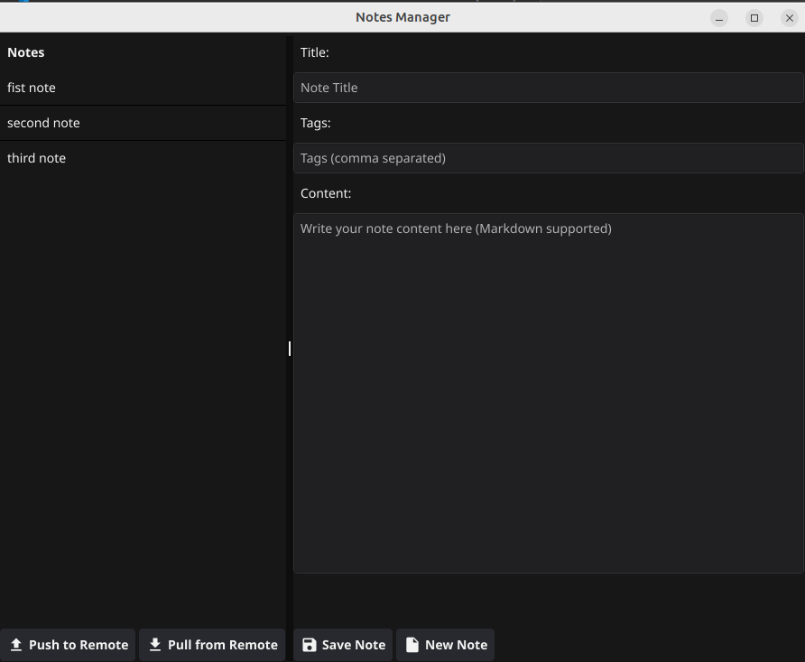

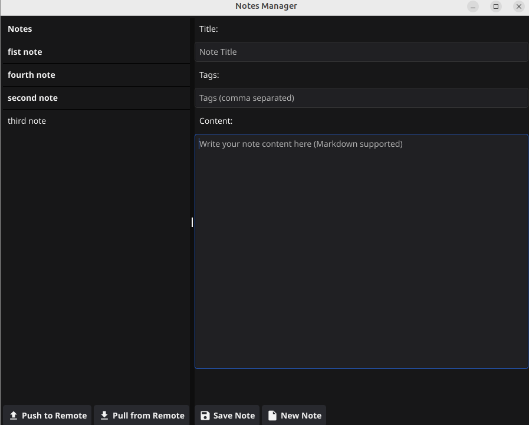

</details>


## Fix ordering

> *Note*: At this point the context was full and I had to start a new chat, pasting the latest version of the application.

This application allows saving notes in a git repository. The panel in the left displays the list of notes. This list should be ordered by creating time, from more recent to less recent.

### Claude response

Based on your code, I see that you have a Go application using the Fyne UI framework to create a notes manager that integrates with Git for version control. It's a nice design with a split panel interface - notes list on the left and editor on the right.

Regarding your request about ordering the notes list by creation time (newest to oldest), I notice that your current implementation in  `listNotes()` retrieves the notes but doesn't apply any ordering. Here's how you can modify your code to sort the notes by creation time:
In the listNotes function, after you've collected all the notes, you need to sort them before returning. You can add a sorting step like this:

```go
// listNotes retrieves all notes from the repository
func listNotes(repoPath string) ([]Note, error) {
    var notes []Note
    
    // Get all .md files
    files, err := filepath.Glob(filepath.Join(repoPath, "*.md"))
    if err != nil {
        return nil, fmt.Errorf("failed to list files: %v", err)
    }
    
    for _, file := range files {
        content, err := ioutil.ReadFile(file)
        if err != nil {
            continue
        }
        
        // Parse note from file
        note, err := parseNoteFromContent(content, filepath.Base(file))
        if err != nil {
            continue
        }
        
        notes = append(notes, note)
    }
    
    // Sort notes by creation time (newest first)
    sort.Slice(notes, func(i, j int) bool {
        return notes[i].Created.After(notes[j].Created)
    })
    
    return notes, nil
}
```

You'll need to add the "sort" package to your imports:

```go
import (
    // existing imports...
    "sort"

)
```

This modification will sort the notes so that the most recent ones appear first in the list, which should make them display in the order you want in the UI panel.

<details>

<summary> screenshots (click to expand) </summary>

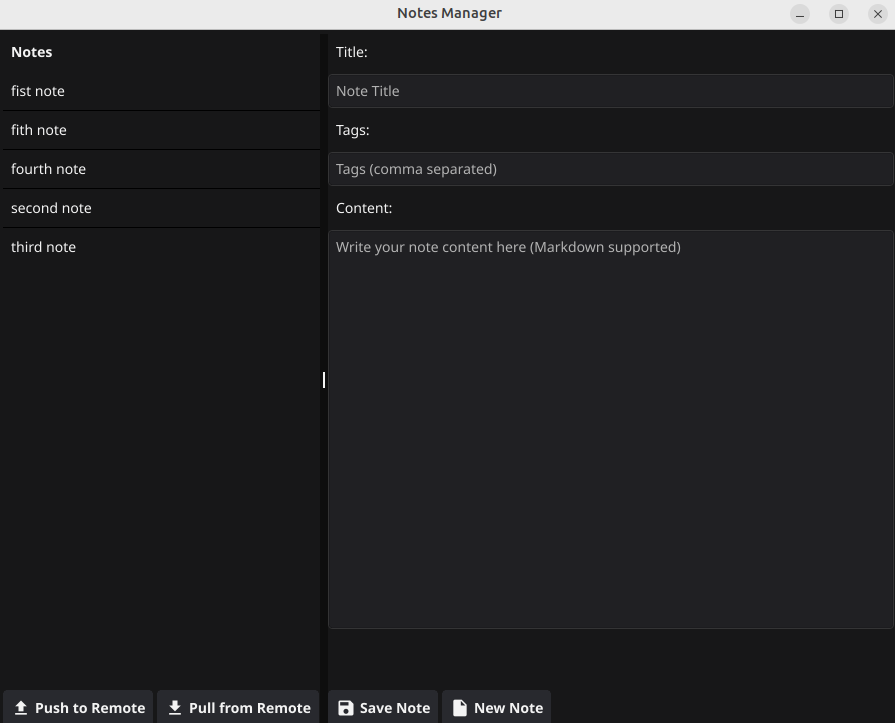

</details>

## Retry fixing ordering

The list is still not ordered.

### Claude response

Let me look at your code more carefully to understand why the list still isn't ordered. The issue might be in how the list is refreshed or displayed.

Looking at your code again, there are a couple of possibilities why the sorting isn't being reflected in the UI:

1. You need to make sure the sorting is actually applied before the UI is refreshed
2. The notesList widget might need more than just a Refresh() call to properly update with the new order

Let's modify your code to ensure the sorting works properly:

```go
// Add this function to your code - it will sort the notes array
func sortNotesByCreationTime(notes []Note) {
    sort.Slice(notes, func(i, j int) bool {
        return notes[i].Created.After(notes[j].Created)
    })
}

// Then modify your refreshNotesList function
refreshNotesList := func() {
    var err error
    notes, err = listNotes(config.RepoPath)
    if err != nil {
        dialog.ShowError(err, w)
        return
    }
    
    // Sort notes by creation time (newest first)
    sortNotesByCreationTime(notes)
    
    // Update the widget - you may need a full refresh
    notesList.Refresh()
}
```

Also, ensure that any time you update the notes slice, you're sorting it afterward. This includes:

1. When initially loading notes in main()
2. After pulling from the remote repository
3. After saving a new note

For the save operation, you might want to modify your save button handler to explicitly re-sort:

```go
saveButton := widget.NewButtonWithIcon("Save Note", theme.DocumentSaveIcon(), func() {
    // ... existing code ...
    
    // Refresh list - make sure this includes sorting
    refreshNotesList()
    
    dialog.ShowInformation("Success", "Note saved successfully", w)
})
```

If this still doesn't work, let me know and we can look deeper into how the Fyne list widget handles data updates.

## ask to apply changes in code instead of showing the difference

can you apply those changes to the code I gave you and generate a full code?

### Claude response


<details>
<summary> Notes Manager App with Sorted List </summary>

```go
package main

import (
	"bufio"
	"fmt"
	"io/ioutil"
	"os"
	"path/filepath"
	"sort"
	"strings"
	"time"

	"fyne.io/fyne/v2"
	"fyne.io/fyne/v2/app"
	"fyne.io/fyne/v2/container"
	"fyne.io/fyne/v2/dialog"
	"fyne.io/fyne/v2/theme"
	"fyne.io/fyne/v2/widget"
	"github.com/go-git/go-git/v5"
	"github.com/go-git/go-git/v5/plumbing/object"
	"github.com/go-git/go-git/v5/plumbing/transport"
)

type Note struct {
	Title   string
	Tags    []string
	Content string
	Created time.Time
}

type AppConfig struct {
	RepoPath string
}

// ensureRepoExists checks if the repo exists and is a git repo
func ensureRepoExists(path string) (*git.Repository, error) {
	if _, err := os.Stat(path); os.IsNotExist(err) {
		// Create directory
		if err := os.MkdirAll(path, 0755); err != nil {
			return nil, fmt.Errorf("failed to create directory: %v", err)
		}
		
		// Initialize git repository
		repo, err := git.PlainInit(path, false)
		if err != nil {
			return nil, fmt.Errorf("failed to initialize git repository: %v", err)
		}
		
		return repo, nil
	}
	
	// Open existing repository
	repo, err := git.PlainOpen(path)
	if err != nil {
		return nil, fmt.Errorf("not a valid git repository: %v", err)
	}
	
	return repo, nil
}

// saveNote saves a note to the repository
func saveNote(note Note, repo *git.Repository, repoPath string) error {
	// Format the filename: YYYY-MM-DD-title.md
	fileName := fmt.Sprintf("%04d-%02d-%02d-%s.md", 
		note.Created.Year(), 
		note.Created.Month(), 
		note.Created.Day(), 
		strings.ReplaceAll(note.Title, " ", "-"))
	
	// Create the file content
	content := fmt.Sprintf("# %s\n\nTags: %s\n\n%s", 
		note.Title, 
		strings.Join(note.Tags, ", "), 
		note.Content)
	
	// Write to file
	filePath := filepath.Join(repoPath, fileName)
	if err := ioutil.WriteFile(filePath, []byte(content), 0644); err != nil {
		return fmt.Errorf("failed to write file: %v", err)
	}
	
	// Get the worktree
	w, err := repo.Worktree()
	if err != nil {
		return fmt.Errorf("failed to get worktree: %v", err)
	}
	
	// Add file to git
	_, err = w.Add(fileName)
	if err != nil {
		return fmt.Errorf("git add failed: %v", err)
	}
	
	// Commit changes
	commitMsg := fmt.Sprintf("Add note: %s", note.Title)
	_, err = w.Commit(commitMsg, &git.CommitOptions{
		Author: &object.Signature{
			Name:  "Notes App",
			Email: "notes@example.com",
			When:  time.Now(),
		},
	})
	if err != nil {
		return fmt.Errorf("git commit failed: %v", err)
	}
	
	return nil
}

// listNotes retrieves all notes from the repository
func listNotes(repoPath string) ([]Note, error) {
	var notes []Note
	
	// Get all .md files
	files, err := filepath.Glob(filepath.Join(repoPath, "*.md"))
	if err != nil {
		return nil, fmt.Errorf("failed to list files: %v", err)
	}
	
	for _, file := range files {
		content, err := ioutil.ReadFile(file)
		if err != nil {
			continue
		}
		
		// Parse note from file
		note, err := parseNoteFromContent(content, filepath.Base(file))
		if err != nil {
			continue
		}
		
		notes = append(notes, note)
	}
	
	return notes, nil
}

// sortNotesByCreationTime sorts notes by creation time (newest first)
func sortNotesByCreationTime(notes []Note) {
	sort.Slice(notes, func(i, j int) bool {
		return notes[i].Created.After(notes[j].Created)
	})
}

// parseNoteFromContent extracts note data from file content
func parseNoteFromContent(content []byte, filename string) (Note, error) {
	var note Note
	
	// Parse creation date and title from filename (YYYY-MM-DD-title.md)
	parts := strings.Split(filename, "-")
	if len(parts) < 4 {
		return note, fmt.Errorf("invalid filename format")
	}
	
	year := parts[0]
	month := parts[1]
	day := parts[2]
	
	// Extract title (join remaining parts and remove .md)
	titleParts := parts[3:]
	title := strings.Join(titleParts, "-")
	title = strings.TrimSuffix(title, ".md")
	title = strings.ReplaceAll(title, "-", " ")
	
	// Parse date
	dateStr := fmt.Sprintf("%s-%s-%s", year, month, day)
	created, err := time.Parse("2006-01-02", dateStr)
	if err != nil {
		return note, fmt.Errorf("invalid date format: %v", err)
	}
	
	// Parse content
	contentStr := string(content)
	scanner := bufio.NewScanner(strings.NewReader(contentStr))
	
	// First line should be title
	if scanner.Scan() {
		titleLine := scanner.Text()
		if strings.HasPrefix(titleLine, "# ") {
			note.Title = strings.TrimPrefix(titleLine, "# ")
		}
	}
	
	// Look for tags
	var contentBuilder strings.Builder
	foundTags := false
	
	for scanner.Scan() {
		line := scanner.Text()
		
		if !foundTags && strings.HasPrefix(line, "Tags: ") {
			tagsStr := strings.TrimPrefix(line, "Tags: ")
			tags := strings.Split(tagsStr, ", ")
			note.Tags = tags
			foundTags = true
			continue
		}
		
		// Add to content
		contentBuilder.WriteString(line)
		contentBuilder.WriteString("\n")
	}
	
	note.Content = contentBuilder.String()
	note.Created = created
	
	if note.Title == "" {
		note.Title = title // Use filename-derived title if not found in content
	}
	
	return note, nil
}

// pushToRemote pushes changes to remote repository
func pushToRemote(repo *git.Repository) error {
	// Push using go-git
	err := repo.Push(&git.PushOptions{
		RemoteName: "origin",
		Progress:   os.Stdout,
	})
	
	if err != nil && err != transport.ErrEmptyRemoteRepository {
		return fmt.Errorf("git push failed: %v", err)
	}
	
	return nil
}

// pullFromRemote pulls changes from remote repository
func pullFromRemote(repo *git.Repository) error {
	w, err := repo.Worktree()
	if err != nil {
		return fmt.Errorf("failed to get worktree: %v", err)
	}
	
	err = w.Pull(&git.PullOptions{
		RemoteName: "origin",
		Progress:   os.Stdout,
	})
	
	if err != nil && err != git.NoErrAlreadyUpToDate {
		return fmt.Errorf("git pull failed: %v", err)
	}
	
	return nil
}

func main() {
	// Configuration
	homeDir, _ := os.UserHomeDir()
	config := AppConfig{
		RepoPath: filepath.Join(homeDir, "notes-repo"),
	}
	
	// Ensure repository exists
	repo, err := ensureRepoExists(config.RepoPath)
	if err != nil {
		fmt.Printf("Error initializing repository: %v\n", err)
		os.Exit(1)
	}
	
	// Create Fyne app
	a := app.New()
	a.Settings().SetTheme(theme.DarkTheme())
	w := a.NewWindow("Notes Manager")
	w.Resize(fyne.NewSize(900, 700))
	
	// UI elements
	titleEntry := widget.NewEntry()
	titleEntry.SetPlaceHolder("Note Title")
	
	tagsEntry := widget.NewEntry()
	tagsEntry.SetPlaceHolder("Tags (comma separated)")
	
	// Create multiline content entry with proper scrolling
	contentEntry := widget.NewMultiLineEntry()
	contentEntry.SetPlaceHolder("Write your note content here (Markdown supported)")
	contentEntry.Wrapping = fyne.TextWrapWord  // Enable word wrapping
	
	// Content entry should take up all available space
	contentEntryScroll := container.NewScroll(contentEntry)
	contentEntryScroll.SetMinSize(fyne.NewSize(500, 400))  // Set minimum size for content area
	
	// Initialize notes slice
	var notes []Note
	
	// Create list widget with proper binding to notes slice
	notesList := widget.NewList(
		func() int { 
			return len(notes) // This will update when notes slice changes
		},
		func() fyne.CanvasObject {
			// Make the template item more visible with proper styling
			return container.NewHBox(
				widget.NewLabel(""),
			)
		},
		func(id widget.ListItemID, obj fyne.CanvasObject) {
			if id < len(notes) {
				// Get the label from the container
				label := obj.(*fyne.Container).Objects[0].(*widget.Label)
				label.SetText(notes[id].Title)
				// Make text bold and properly styled
				label.TextStyle = fyne.TextStyle{Bold: true}
				label.Alignment = fyne.TextAlignLeading
			}
		},
	)
	
	// Custom item size to make list items taller and more visible
	notesList.OnSelected = func(id widget.ListItemID) {
		if id < len(notes) {
			selectedNote := notes[id]
			titleEntry.SetText(selectedNote.Title)
			tagsEntry.SetText(strings.Join(selectedNote.Tags, ", "))
			contentEntry.SetText(selectedNote.Content)
		}
	}
	
	// Function to refresh the notes list
	refreshNotesList := func() {
		var err error
		notes, err = listNotes(config.RepoPath)
		if err != nil {
			dialog.ShowError(err, w)
			return
		}
		
		// Sort notes by creation time (newest first)
		sortNotesByCreationTime(notes)
		
		// Fully refresh the list widget
		notesList.Refresh()
	}
	
	// Buttons
	saveButton := widget.NewButtonWithIcon("Save Note", theme.DocumentSaveIcon(), func() {
		if titleEntry.Text == "" {
			dialog.ShowInformation("Error", "Title cannot be empty", w)
			return
		}
		
		// Create note
		note := Note{
			Title:   titleEntry.Text,
			Content: contentEntry.Text,
			Created: time.Now(),
		}
		
		// Parse tags
		if tagsEntry.Text != "" {
			tagsList := strings.Split(tagsEntry.Text, ",")
			for i, tag := range tagsList {
				tagsList[i] = strings.TrimSpace(tag)
			}
			note.Tags = tagsList
		}
		
		// Save note
		if err := saveNote(note, repo, config.RepoPath); err != nil {
			dialog.ShowError(err, w)
			return
		}
		
		// Clear fields
		titleEntry.SetText("")
		tagsEntry.SetText("")
		contentEntry.SetText("")
		
		// Refresh list (including sorting)
		refreshNotesList()
		
		dialog.ShowInformation("Success", "Note saved successfully", w)
	})
	
	pushButton := widget.NewButtonWithIcon("Push to Remote", theme.UploadIcon(), func() {
		// Push to remote repository
		if err := pushToRemote(repo); err != nil {
			dialog.ShowError(err, w)
			return
		}
		
		dialog.ShowInformation("Success", "Changes pushed to remote repository", w)
	})
	
	pullButton := widget.NewButtonWithIcon("Pull from Remote", theme.DownloadIcon(), func() {
		// Pull from remote repository
		if err := pullFromRemote(repo); err != nil {
			dialog.ShowError(err, w)
			return
		}
		
		// Refresh list (including sorting)
		refreshNotesList()
		
		dialog.ShowInformation("Success", "Changes pulled from remote repository", w)
	})
	
	newButton := widget.NewButtonWithIcon("New Note", theme.FileIcon(), func() {
		// Clear fields
		titleEntry.SetText("")
		tagsEntry.SetText("")
		contentEntry.SetText("")
	})
	
	// Layout
	// Create a form layout for title and tags
	formContainer := container.NewVBox(
		widget.NewLabel("Title:"),
		titleEntry,
		widget.NewLabel("Tags:"),
		tagsEntry,
	)
	
	// Content area with label
	contentContainer := container.NewVBox(
		widget.NewLabel("Content:"),
		contentEntryScroll,  // Use the scrollable container
	)
	
	// Buttons container
	buttonContainer := container.NewHBox(
		saveButton,
		newButton,
	)
	
	// Stack everything in the editor area
	editorContainer := container.NewBorder(
		formContainer,  // Top
		buttonContainer, // Bottom
		nil,            // Left
		nil,            // Right
		contentContainer, // Center (fills remaining space)
	)
	
	// List panel header
	listHeader := widget.NewLabelWithStyle("Notes", fyne.TextAlignLeading, fyne.TextStyle{Bold: true})
	
	// Git operation buttons in the list panel
	gitButtonsContainer := container.NewHBox(
		pushButton,
		pullButton,
	)
	
	// Make the notes list fill all available space
	listContent := container.NewBorder(
		listHeader,       // Top
		gitButtonsContainer, // Bottom
		nil,              // Left
		nil,              // Right
		notesList,        // Center (fills remaining space)
	)
	
	// Set minimum size for list container
	// The list panel should take about 25% of the window width, but at least 200px
	split := container.NewHSplit(
		listContent,
		editorContainer,
	)
	split.SetOffset(0.25) // 25% for list, 75% for editor
	
	// Set main container
	w.SetContent(split)
	
	// Initial refresh (including sorting)
	refreshNotesList()
	
	// Show and run
	w.ShowAndRun()
}
```

</details>


I've updated the code to sort the notes by creation time with newest first. Here are the key changes I made:

1. Added a new sortNotesByCreationTime function that sorts the notes slice with the most recent notes first:

```go
func sortNotesByCreationTime(notes []Note) {
    sort.Slice(notes, func(i, j int) bool {
        return notes[i].Created.After(notes[j].Created)
    })
}
```

2. Added the "sort" package to the imports
3. Modified the refreshNotesList function to sort the notes after retrieving them:

```go
refreshNotesList := func() {
    var err error
    notes, err = listNotes(config.RepoPath)
    if err != nil {
        dialog.ShowError(err, w)
        return
    }
    
    // Sort notes by creation time (newest first)
    sortNotesByCreationTime(notes)
    
    // Fully refresh the list widget
    notesList.Refresh()
}
```

4. Ensured that sorting is applied during the initial loading of notes and after any operations that modify the notes collection (save, pull)

These changes will ensure that the notes list is always displayed with the newest notes at the top, which should solve your ordering issue.


## Sort by date and title

At this point, I had to review the code and realized that the notes were sorted but only by data and as all were created the same day, the order appeared random

I asked claude the following:

> Sort the notes by creation date and title. Apply the changes to the existing code and show me the full code

### Claude response

<details>
<summary>Notes Manager App with Sorted List (click to expand) </summary>

```go
package main

import (
	"bufio"
	"fmt"
	"io/ioutil"
	"os"
	"path/filepath"
	"sort"
	"strings"
	"time"

	"fyne.io/fyne/v2"
	"fyne.io/fyne/v2/app"
	"fyne.io/fyne/v2/container"
	"fyne.io/fyne/v2/dialog"
	"fyne.io/fyne/v2/theme"
	"fyne.io/fyne/v2/widget"
	"github.com/go-git/go-git/v5"
	"github.com/go-git/go-git/v5/plumbing/object"
	"github.com/go-git/go-git/v5/plumbing/transport"
)

type Note struct {
	Title   string
	Tags    []string
	Content string
	Created time.Time
}

type AppConfig struct {
	RepoPath string
}

// ensureRepoExists checks if the repo exists and is a git repo
func ensureRepoExists(path string) (*git.Repository, error) {
	if _, err := os.Stat(path); os.IsNotExist(err) {
		// Create directory
		if err := os.MkdirAll(path, 0755); err != nil {
			return nil, fmt.Errorf("failed to create directory: %v", err)
		}
		
		// Initialize git repository
		repo, err := git.PlainInit(path, false)
		if err != nil {
			return nil, fmt.Errorf("failed to initialize git repository: %v", err)
		}
		
		return repo, nil
	}
	
	// Open existing repository
	repo, err := git.PlainOpen(path)
	if err != nil {
		return nil, fmt.Errorf("not a valid git repository: %v", err)
	}
	
	return repo, nil
}

// saveNote saves a note to the repository
func saveNote(note Note, repo *git.Repository, repoPath string) error {
	// Format the filename: YYYY-MM-DD-title.md
	fileName := fmt.Sprintf("%04d-%02d-%02d-%s.md", 
		note.Created.Year(), 
		note.Created.Month(), 
		note.Created.Day(), 
		strings.ReplaceAll(note.Title, " ", "-"))
	
	// Create the file content
	content := fmt.Sprintf("# %s\n\nTags: %s\n\n%s", 
		note.Title, 
		strings.Join(note.Tags, ", "), 
		note.Content)
	
	// Write to file
	filePath := filepath.Join(repoPath, fileName)
	if err := ioutil.WriteFile(filePath, []byte(content), 0644); err != nil {
		return fmt.Errorf("failed to write file: %v", err)
	}
	
	// Get the worktree
	w, err := repo.Worktree()
	if err != nil {
		return fmt.Errorf("failed to get worktree: %v", err)
	}
	
	// Add file to git
	_, err = w.Add(fileName)
	if err != nil {
		return fmt.Errorf("git add failed: %v", err)
	}
	
	// Commit changes
	commitMsg := fmt.Sprintf("Add note: %s", note.Title)
	_, err = w.Commit(commitMsg, &git.CommitOptions{
		Author: &object.Signature{
			Name:  "Notes App",
			Email: "notes@example.com",
			When:  time.Now(),
		},
	})
	if err != nil {
		return fmt.Errorf("git commit failed: %v", err)
	}
	
	return nil
}

// listNotes retrieves all notes from the repository
func listNotes(repoPath string) ([]Note, error) {
	var notes []Note
	
	// Get all .md files
	files, err := filepath.Glob(filepath.Join(repoPath, "*.md"))
	if err != nil {
		return nil, fmt.Errorf("failed to list files: %v", err)
	}
	
	for _, file := range files {
		content, err := ioutil.ReadFile(file)
		if err != nil {
			continue
		}
		
		// Parse note from file
		note, err := parseNoteFromContent(content, filepath.Base(file))
		if err != nil {
			continue
		}
		
		notes = append(notes, note)
	}
	
	return notes, nil
}

// sortNotesByDateAndTitle sorts notes first by creation date (newest first)
// and then by title (alphabetically) for notes with the same date
func sortNotesByDateAndTitle(notes []Note) {
	sort.Slice(notes, func(i, j int) bool {
	    // First compare by date (newest first)
	    if !notes[i].Created.Equal(notes[j].Created) {
		return notes[i].Created.After(notes[j].Created)
	    }
	    // If dates are equal, compare by title (alphabetically)
	    return strings.ToLower(notes[i].Title) < strings.ToLower(notes[j].Title)
	})    
}

// parseNoteFromContent extracts note data from file content
func parseNoteFromContent(content []byte, filename string) (Note, error) {
	var note Note
	
	// Parse creation date and title from filename (YYYY-MM-DD-title.md)
	parts := strings.Split(filename, "-")
	if len(parts) < 4 {
		return note, fmt.Errorf("invalid filename format")
	}
	
	year := parts[0]
	month := parts[1]
	day := parts[2]
	
	// Extract title (join remaining parts and remove .md)
	titleParts := parts[3:]
	title := strings.Join(titleParts, "-")
	title = strings.TrimSuffix(title, ".md")
	title = strings.ReplaceAll(title, "-", " ")
	
	// Parse date
	dateStr := fmt.Sprintf("%s-%s-%s", year, month, day)
	created, err := time.Parse("2006-01-02", dateStr)
	if err != nil {
		return note, fmt.Errorf("invalid date format: %v", err)
	}
	
	// Parse content
	contentStr := string(content)
	scanner := bufio.NewScanner(strings.NewReader(contentStr))
	
	// First line should be title
	if scanner.Scan() {
		titleLine := scanner.Text()
		if strings.HasPrefix(titleLine, "# ") {
			note.Title = strings.TrimPrefix(titleLine, "# ")
		}
	}
	
	// Look for tags
	var contentBuilder strings.Builder
	foundTags := false
	
	for scanner.Scan() {
		line := scanner.Text()
		
		if !foundTags && strings.HasPrefix(line, "Tags: ") {
			tagsStr := strings.TrimPrefix(line, "Tags: ")
			tags := strings.Split(tagsStr, ", ")
			note.Tags = tags
			foundTags = true
			continue
		}
		
		// Add to content
		contentBuilder.WriteString(line)
		contentBuilder.WriteString("\n")
	}
	
	note.Content = contentBuilder.String()
	note.Created = created
	
	if note.Title == "" {
		note.Title = title // Use filename-derived title if not found in content
	}
	
	return note, nil
}

// pushToRemote pushes changes to remote repository
func pushToRemote(repo *git.Repository) error {
	// Push using go-git
	err := repo.Push(&git.PushOptions{
		RemoteName: "origin",
		Progress:   os.Stdout,
	})
	
	if err != nil && err != transport.ErrEmptyRemoteRepository {
		return fmt.Errorf("git push failed: %v", err)
	}
	
	return nil
}

// pullFromRemote pulls changes from remote repository
func pullFromRemote(repo *git.Repository) error {
	w, err := repo.Worktree()
	if err != nil {
		return fmt.Errorf("failed to get worktree: %v", err)
	}
	
	err = w.Pull(&git.PullOptions{
		RemoteName: "origin",
		Progress:   os.Stdout,
	})
	
	if err != nil && err != git.NoErrAlreadyUpToDate {
		return fmt.Errorf("git pull failed: %v", err)
	}
	
	return nil
}

func main() {
	// Configuration
	homeDir, _ := os.UserHomeDir()
	config := AppConfig{
		RepoPath: filepath.Join(homeDir, "notes-repo"),
	}
	
	// Ensure repository exists
	repo, err := ensureRepoExists(config.RepoPath)
	if err != nil {
		fmt.Printf("Error initializing repository: %v\n", err)
		os.Exit(1)
	}
	
	// Create Fyne app
	a := app.New()
	a.Settings().SetTheme(theme.DarkTheme())
	w := a.NewWindow("Notes Manager")
	w.Resize(fyne.NewSize(900, 700))
	
	// UI elements
	titleEntry := widget.NewEntry()
	titleEntry.SetPlaceHolder("Note Title")
	
	tagsEntry := widget.NewEntry()
	tagsEntry.SetPlaceHolder("Tags (comma separated)")
	
	// Create multiline content entry with proper scrolling
	contentEntry := widget.NewMultiLineEntry()
	contentEntry.SetPlaceHolder("Write your note content here (Markdown supported)")
	contentEntry.Wrapping = fyne.TextWrapWord  // Enable word wrapping
	
	// Content entry should take up all available space
	contentEntryScroll := container.NewScroll(contentEntry)
	contentEntryScroll.SetMinSize(fyne.NewSize(500, 400))  // Set minimum size for content area
	
	// Initialize notes slice
	var notes []Note
	
	// Create list widget with proper binding to notes slice
	notesList := widget.NewList(
		func() int { 
			return len(notes) // This will update when notes slice changes
		},
		func() fyne.CanvasObject {
			// Make the template item more visible with proper styling
			return container.NewHBox(
				widget.NewLabel(""),
			)
		},
		func(id widget.ListItemID, obj fyne.CanvasObject) {
			if id < len(notes) {
				// Get the label from the container
				label := obj.(*fyne.Container).Objects[0].(*widget.Label)
				label.SetText(notes[id].Title)
				// Make text bold and properly styled
				label.TextStyle = fyne.TextStyle{Bold: true}
				label.Alignment = fyne.TextAlignLeading
			}
		},
	)
	
	// Custom item size to make list items taller and more visible
	notesList.OnSelected = func(id widget.ListItemID) {
		if id < len(notes) {
			selectedNote := notes[id]
			titleEntry.SetText(selectedNote.Title)
			tagsEntry.SetText(strings.Join(selectedNote.Tags, ", "))
			contentEntry.SetText(selectedNote.Content)
		}
	}
	
	// Function to refresh the notes list
	refreshNotesList := func() {
		var err error
		notes, err = listNotes(config.RepoPath)
		if err != nil {
			dialog.ShowError(err, w)
			return
		}
		
		// Sort notes by creation time (newest first)
		sortNotesByDateAndTitle(notes)
		
		// Fully refresh the list widget
		notesList.Refresh()
	}
	
	// Buttons
	saveButton := widget.NewButtonWithIcon("Save Note", theme.DocumentSaveIcon(), func() {
		if titleEntry.Text == "" {
			dialog.ShowInformation("Error", "Title cannot be empty", w)
			return
		}
		
		// Create note
		note := Note{
			Title:   titleEntry.Text,
			Content: contentEntry.Text,
			Created: time.Now(),
		}
		
		// Parse tags
		if tagsEntry.Text != "" {
			tagsList := strings.Split(tagsEntry.Text, ",")
			for i, tag := range tagsList {
				tagsList[i] = strings.TrimSpace(tag)
			}
			note.Tags = tagsList
		}
		
		// Save note
		if err := saveNote(note, repo, config.RepoPath); err != nil {
			dialog.ShowError(err, w)
			return
		}
		
		// Clear fields
		titleEntry.SetText("")
		tagsEntry.SetText("")
		contentEntry.SetText("")
		
		// Refresh list (including sorting)
		refreshNotesList()
		
		dialog.ShowInformation("Success", "Note saved successfully", w)
	})
	
	pushButton := widget.NewButtonWithIcon("Push to Remote", theme.UploadIcon(), func() {
		// Push to remote repository
		if err := pushToRemote(repo); err != nil {
			dialog.ShowError(err, w)
			return
		}
		
		dialog.ShowInformation("Success", "Changes pushed to remote repository", w)
	})
	
	pullButton := widget.NewButtonWithIcon("Pull from Remote", theme.DownloadIcon(), func() {
		// Pull from remote repository
		if err := pullFromRemote(repo); err != nil {
			dialog.ShowError(err, w)
			return
		}
		
		// Refresh list (including sorting)
		refreshNotesList()
		
		dialog.ShowInformation("Success", "Changes pulled from remote repository", w)
	})
	
	newButton := widget.NewButtonWithIcon("New Note", theme.FileIcon(), func() {
		// Clear fields
		titleEntry.SetText("")
		tagsEntry.SetText("")
		contentEntry.SetText("")
	})
	
	// Layout
	// Create a form layout for title and tags
	formContainer := container.NewVBox(
		widget.NewLabel("Title:"),
		titleEntry,
		widget.NewLabel("Tags:"),
		tagsEntry,
	)
	
	// Content area with label
	contentContainer := container.NewVBox(
		widget.NewLabel("Content:"),
		contentEntryScroll,  // Use the scrollable container
	)
	
	// Buttons container
	buttonContainer := container.NewHBox(
		saveButton,
		newButton,
	)
	
	// Stack everything in the editor area
	editorContainer := container.NewBorder(
		formContainer,  // Top
		buttonContainer, // Bottom
		nil,            // Left
		nil,            // Right
		contentContainer, // Center (fills remaining space)
	)
	
	// List panel header
	listHeader := widget.NewLabelWithStyle("Notes", fyne.TextAlignLeading, fyne.TextStyle{Bold: true})
	
	// Git operation buttons in the list panel
	gitButtonsContainer := container.NewHBox(
		pushButton,
		pullButton,
	)
	
	// Make the notes list fill all available space
	listContent := container.NewBorder(
		listHeader,       // Top
		gitButtonsContainer, // Bottom
		nil,              // Left
		nil,              // Right
		notesList,        // Center (fills remaining space)
	)
	
	// Set minimum size for list container
	// The list panel should take about 25% of the window width, but at least 200px
	split := container.NewHSplit(
		listContent,
		editorContainer,
	)
	split.SetOffset(0.25) // 25% for list, 75% for editor
	
	// Set main container
	w.SetContent(split)
	
	// Initial refresh (including sorting)
	refreshNotesList()
	
	// Show and run
	w.ShowAndRun()
}
```

</details>

I've updated the code to sort the notes by both creation date and title. The primary sort is by creation date (newest first), and for notes created on the same date, they're sorted alphabetically by title. Here are the key changes:

1. Replaced the previous sorting function with a new sortNotesByDateAndTitle function:

```go
// sortNotesByDateAndTitle sorts notes first by creation date (newest first)
// and then by title (alphabetically) for notes with the same date
func sortNotesByDateAndTitle(notes []Note) {
    sort.Slice(notes, func(i, j int) bool {
        // First compare by date (newest first)
        if !notes[i].Created.Equal(notes[j].Created) {
            return notes[i].Created.After(notes[j].Created)
        }
        // If dates are equal, compare by title (alphabetically)
        return strings.ToLower(notes[i].Title) < strings.ToLower(notes[j].Title)
    })
}
```

2. Updated all the references to the sorting function in the refreshNotesList function and other places to use the new function.
Added case insensitivity to the title comparison (using strings.ToLower) to ensure a more natural alphabetical sorting.

3. This implementation will first group notes by their creation date (newest first), and then within each date group, sort them alphabetically by title. This gives you a clear chronological organization with a predictable alphabetical sub-ordering.


## New session, configuration of the application

I pasted the code of the application and started with this prompt:

> I have this application developed by you. It allows creating notes with labels and storing in a git repository. It works as intended. I want to make some improvements. I will detail each one at a time and you will provide me with the whole code modified (not only the changes). 
> The first requirement is that the name path to the repository should not be hard code in application. It should be read from the .git-notes.conf file in the user's home directory. 
> If the configuration file doesn't exists create it. 
> When creating the config file ask the user for the path to the git repository to use for saving the notes and offer the notes-repo in the home directory as the default value.

### Claude response

I'll help you implement the configuration file feature. This will allow the application to read the repository path from a .git-notes.conf file instead of hardcoding it, and create the configuration file if it doesn't exist.
Here's the complete modified code:

<details
<summary>Git Notes App with Configuration File (click to expand)</summary>

```go
package main

import (
	"bufio"
	"fmt"
	"io/ioutil"
	"os"
	"path/filepath"
	"sort"
	"strings"
	"time"

	"fyne.io/fyne/v2"
	"fyne.io/fyne/v2/app"
	"fyne.io/fyne/v2/container"
	"fyne.io/fyne/v2/dialog"
	"fyne.io/fyne/v2/theme"
	"fyne.io/fyne/v2/widget"
	"github.com/go-git/go-git/v5"
	"github.com/go-git/go-git/v5/plumbing/object"
	"github.com/go-git/go-git/v5/plumbing/transport"
)

type Note struct {
	Title   string
	Tags    []string
	Content string
	Created time.Time
}

type AppConfig struct {
	RepoPath string
}

// loadConfig loads the configuration from .git-notes.conf file
func loadConfig() (AppConfig, error) {
	config := AppConfig{}
	homeDir, err := os.UserHomeDir()
	if err != nil {
		return config, fmt.Errorf("failed to get user home directory: %v", err)
	}

	configPath := filepath.Join(homeDir, ".git-notes.conf")
	
	// Check if config file exists
	if _, err := os.Stat(configPath); os.IsNotExist(err) {
		// Config file doesn't exist, create it
		return createConfigFile(homeDir, configPath)
	}
	
	// Read the config file
	content, err := ioutil.ReadFile(configPath)
	if err != nil {
		return config, fmt.Errorf("failed to read config file: %v", err)
	}
	
	// Parse config file
	lines := strings.Split(string(content), "\n")
	for _, line := range lines {
		line = strings.TrimSpace(line)
		if strings.HasPrefix(line, "REPO_PATH=") {
			config.RepoPath = strings.TrimPrefix(line, "REPO_PATH=")
		}
	}
	
	// Validate config
	if config.RepoPath == "" {
		return config, fmt.Errorf("repository path not found in config file")
	}
	
	return config, nil
}

// createConfigFile creates a new configuration file with user input
func createConfigFile(homeDir, configPath string) (AppConfig, error) {
	config := AppConfig{}
	
	// Default repository path
	defaultRepoPath := filepath.Join(homeDir, "notes-repo")
	
	// Ask user for repository path using dialog
	a := app.New()
	w := a.NewWindow("Git Notes Configuration")
	w.Resize(fyne.NewSize(400, 200))
	
	// Entry for repository path
	repoPathEntry := widget.NewEntry()
	repoPathEntry.SetText(defaultRepoPath)
	
	// Form for the dialog
	form := &widget.Form{
		Items: []*widget.FormItem{
			{Text: "Repository Path:", Widget: repoPathEntry},
		},
	}
	
	// Channel to get the result
	done := make(chan bool)
	
	// Create and show dialog
	dialog.ShowCustomConfirm("Git Notes Configuration", "Save", "Cancel", form, func(save bool) {
		if save {
			config.RepoPath = repoPathEntry.Text
			
			// Write to config file
			configContent := fmt.Sprintf("REPO_PATH=%s\n", config.RepoPath)
			err := ioutil.WriteFile(configPath, []byte(configContent), 0644)
			if err != nil {
				dialog.ShowError(fmt.Errorf("failed to write config file: %v", err), w)
			}
		} else {
			// Use default if canceled
			config.RepoPath = defaultRepoPath
			
			// Write default to config file
			configContent := fmt.Sprintf("REPO_PATH=%s\n", config.RepoPath)
			err := ioutil.WriteFile(configPath, []byte(configContent), 0644)
			if err != nil {
				dialog.ShowError(fmt.Errorf("failed to write config file: %v", err), w)
			}
		}
		done <- true
	}, w)
	
	<-done // Wait for dialog to complete
	w.Close()
	
	return config, nil
}

// ensureRepoExists checks if the repo exists and is a git repo
func ensureRepoExists(path string) (*git.Repository, error) {
	if _, err := os.Stat(path); os.IsNotExist(err) {
		// Create directory
		if err := os.MkdirAll(path, 0755); err != nil {
			return nil, fmt.Errorf("failed to create directory: %v", err)
		}
		
		// Initialize git repository
		repo, err := git.PlainInit(path, false)
		if err != nil {
			return nil, fmt.Errorf("failed to initialize git repository: %v", err)
		}
		
		return repo, nil
	}
	
	// Open existing repository
	repo, err := git.PlainOpen(path)
	if err != nil {
		return nil, fmt.Errorf("not a valid git repository: %v", err)
	}
	
	return repo, nil
}

// saveNote saves a note to the repository
func saveNote(note Note, repo *git.Repository, repoPath string) error {
	// Format the filename: YYYY-MM-DD-title.md
	fileName := fmt.Sprintf("%04d-%02d-%02d-%s.md", 
		note.Created.Year(), 
		note.Created.Month(), 
		note.Created.Day(), 
		strings.ReplaceAll(note.Title, " ", "-"))
	
	// Create the file content
	content := fmt.Sprintf("# %s\n\nTags: %s\n\n%s", 
		note.Title, 
		strings.Join(note.Tags, ", "), 
		note.Content)
	
	// Write to file
	filePath := filepath.Join(repoPath, fileName)
	if err := ioutil.WriteFile(filePath, []byte(content), 0644); err != nil {
		return fmt.Errorf("failed to write file: %v", err)
	}
	
	// Get the worktree
	w, err := repo.Worktree()
	if err != nil {
		return fmt.Errorf("failed to get worktree: %v", err)
	}
	
	// Add file to git
	_, err = w.Add(fileName)
	if err != nil {
		return fmt.Errorf("git add failed: %v", err)
	}
	
	// Commit changes
	commitMsg := fmt.Sprintf("Add note: %s", note.Title)
	_, err = w.Commit(commitMsg, &git.CommitOptions{
		Author: &object.Signature{
			Name:  "Notes App",
			Email: "notes@example.com",
			When:  time.Now(),
		},
	})
	if err != nil {
		return fmt.Errorf("git commit failed: %v", err)
	}
	
	return nil
}

// listNotes retrieves all notes from the repository
func listNotes(repoPath string) ([]Note, error) {
	var notes []Note
	
	// Get all .md files
	files, err := filepath.Glob(filepath.Join(repoPath, "*.md"))
	if err != nil {
		return nil, fmt.Errorf("failed to list files: %v", err)
	}
	
	for _, file := range files {
		content, err := ioutil.ReadFile(file)
		if err != nil {
			continue
		}
		
		// Parse note from file
		note, err := parseNoteFromContent(content, filepath.Base(file))
		if err != nil {
			continue
		}
		
		notes = append(notes, note)
	}
	
	return notes, nil
}

// sortNotesByDateAndTitle sorts notes first by creation date (newest first)
// and then by title (alphabetically) for notes with the same date
func sortNotesByDateAndTitle(notes []Note) {
	sort.Slice(notes, func(i, j int) bool {
	    // First compare by date (newest first)
	    if !notes[i].Created.Equal(notes[j].Created) {
		return notes[i].Created.After(notes[j].Created)
	    }
	    // If dates are equal, compare by title (alphabetically)
	    return strings.ToLower(notes[i].Title) < strings.ToLower(notes[j].Title)
	})    
}

// parseNoteFromContent extracts note data from file content
func parseNoteFromContent(content []byte, filename string) (Note, error) {
	var note Note
	
	// Parse creation date and title from filename (YYYY-MM-DD-title.md)
	parts := strings.Split(filename, "-")
	if len(parts) < 4 {
		return note, fmt.Errorf("invalid filename format")
	}
	
	year := parts[0]
	month := parts[1]
	day := parts[2]
	
	// Extract title (join remaining parts and remove .md)
	titleParts := parts[3:]
	title := strings.Join(titleParts, "-")
	title = strings.TrimSuffix(title, ".md")
	title = strings.ReplaceAll(title, "-", " ")
	
	// Parse date
	dateStr := fmt.Sprintf("%s-%s-%s", year, month, day)
	created, err := time.Parse("2006-01-02", dateStr)
	if err != nil {
		return note, fmt.Errorf("invalid date format: %v", err)
	}
	
	// Parse content
	contentStr := string(content)
	scanner := bufio.NewScanner(strings.NewReader(contentStr))
	
	// First line should be title
	if scanner.Scan() {
		titleLine := scanner.Text()
		if strings.HasPrefix(titleLine, "# ") {
			note.Title = strings.TrimPrefix(titleLine, "# ")
		}
	}
	
	// Look for tags
	var contentBuilder strings.Builder
	foundTags := false
	
	for scanner.Scan() {
		line := scanner.Text()
		
		if !foundTags && strings.HasPrefix(line, "Tags: ") {
			tagsStr := strings.TrimPrefix(line, "Tags: ")
			tags := strings.Split(tagsStr, ", ")
			note.Tags = tags
			foundTags = true
			continue
		}
		
		// Add to content
		contentBuilder.WriteString(line)
		contentBuilder.WriteString("\n")
	}
	
	note.Content = contentBuilder.String()
	note.Created = created
	
	if note.Title == "" {
		note.Title = title // Use filename-derived title if not found in content
	}
	
	return note, nil
}

// pushToRemote pushes changes to remote repository
func pushToRemote(repo *git.Repository) error {
	// Push using go-git
	err := repo.Push(&git.PushOptions{
		RemoteName: "origin",
		Progress:   os.Stdout,
	})
	
	if err != nil && err != transport.ErrEmptyRemoteRepository {
		return fmt.Errorf("git push failed: %v", err)
	}
	
	return nil
}

// pullFromRemote pulls changes from remote repository
func pullFromRemote(repo *git.Repository) error {
	w, err := repo.Worktree()
	if err != nil {
		return fmt.Errorf("failed to get worktree: %v", err)
	}
	
	err = w.Pull(&git.PullOptions{
		RemoteName: "origin",
		Progress:   os.Stdout,
	})
	
	if err != nil && err != git.NoErrAlreadyUpToDate {
		return fmt.Errorf("git pull failed: %v", err)
	}
	
	return nil
}

func main() {
	// Load configuration
	config, err := loadConfig()
	if err != nil {
		fmt.Printf("Error loading configuration: %v\n", err)
		os.Exit(1)
	}
	
	// Ensure repository exists
	repo, err := ensureRepoExists(config.RepoPath)
	if err != nil {
		fmt.Printf("Error initializing repository: %v\n", err)
		os.Exit(1)
	}
	
	// Create Fyne app
	a := app.New()
	a.Settings().SetTheme(theme.DarkTheme())
	w := a.NewWindow("Notes Manager")
	w.Resize(fyne.NewSize(900, 700))
	
	// UI elements
	titleEntry := widget.NewEntry()
	titleEntry.SetPlaceHolder("Note Title")
	
	tagsEntry := widget.NewEntry()
	tagsEntry.SetPlaceHolder("Tags (comma separated)")
	
	// Create multiline content entry with proper scrolling
	contentEntry := widget.NewMultiLineEntry()
	contentEntry.SetPlaceHolder("Write your note content here (Markdown supported)")
	contentEntry.Wrapping = fyne.TextWrapWord  // Enable word wrapping
	
	// Content entry should take up all available space
	contentEntryScroll := container.NewScroll(contentEntry)
	contentEntryScroll.SetMinSize(fyne.NewSize(500, 400))  // Set minimum size for content area
	
	// Initialize notes slice
	var notes []Note
	
	// Create list widget with proper binding to notes slice
	notesList := widget.NewList(
		func() int { 
			return len(notes) // This will update when notes slice changes
		},
		func() fyne.CanvasObject {
			// Make the template item more visible with proper styling
			return container.NewHBox(
				widget.NewLabel(""),
			)
		},
		func(id widget.ListItemID, obj fyne.CanvasObject) {
			if id < len(notes) {
				// Get the label from the container
				label := obj.(*fyne.Container).Objects[0].(*widget.Label)
				label.SetText(notes[id].Title)
				// Make text bold and properly styled
				label.TextStyle = fyne.TextStyle{Bold: true}
				label.Alignment = fyne.TextAlignLeading
			}
		},
	)
	
	// Custom item size to make list items taller and more visible
	notesList.OnSelected = func(id widget.ListItemID) {
		if id < len(notes) {
			selectedNote := notes[id]
			titleEntry.SetText(selectedNote.Title)
			tagsEntry.SetText(strings.Join(selectedNote.Tags, ", "))
			contentEntry.SetText(selectedNote.Content)
		}
	}
	
	// Function to refresh the notes list
	refreshNotesList := func() {
		var err error
		notes, err = listNotes(config.RepoPath)
		if err != nil {
			dialog.ShowError(err, w)
			return
		}
		
		// Sort notes by creation time (newest first)
		sortNotesByDateAndTitle(notes)
		
		// Fully refresh the list widget
		notesList.Refresh()
	}
	
	// Buttons
	saveButton := widget.NewButtonWithIcon("Save Note", theme.DocumentSaveIcon(), func() {
		if titleEntry.Text == "" {
			dialog.ShowInformation("Error", "Title cannot be empty", w)
			return
		}
		
		// Create note
		note := Note{
			Title:   titleEntry.Text,
			Content: contentEntry.Text,
			Created: time.Now(),
		}
		
		// Parse tags
		if tagsEntry.Text != "" {
			tagsList := strings.Split(tagsEntry.Text, ",")
			for i, tag := range tagsList {
				tagsList[i] = strings.TrimSpace(tag)
			}
			note.Tags = tagsList
		}
		
		// Save note
		if err := saveNote(note, repo, config.RepoPath); err != nil {
			dialog.ShowError(err, w)
			return
		}
		
		// Clear fields
		titleEntry.SetText("")
		tagsEntry.SetText("")
		contentEntry.SetText("")
		
		// Refresh list (including sorting)
		refreshNotesList()
		
		dialog.ShowInformation("Success", "Note saved successfully", w)
	})
	
	pushButton := widget.NewButtonWithIcon("Push to Remote", theme.UploadIcon(), func() {
		// Push to remote repository
		if err := pushToRemote(repo); err != nil {
			dialog.ShowError(err, w)
			return
		}
		
		dialog.ShowInformation("Success", "Changes pushed to remote repository", w)
	})
	
	pullButton := widget.NewButtonWithIcon("Pull from Remote", theme.DownloadIcon(), func() {
		// Pull from remote repository
		if err := pullFromRemote(repo); err != nil {
			dialog.ShowError(err, w)
			return
		}
		
		// Refresh list (including sorting)
		refreshNotesList()
		
		dialog.ShowInformation("Success", "Changes pulled from remote repository", w)
	})
	
	newButton := widget.NewButtonWithIcon("New Note", theme.FileIcon(), func() {
		// Clear fields
		titleEntry.SetText("")
		tagsEntry.SetText("")
		contentEntry.SetText("")
	})
	
	// Layout
	// Create a form layout for title and tags
	formContainer := container.NewVBox(
		widget.NewLabel("Title:"),
		titleEntry,
		widget.NewLabel("Tags:"),
		tagsEntry,
	)
	
	// Content area with label
	contentContainer := container.NewVBox(
		widget.NewLabel("Content:"),
		contentEntryScroll,  // Use the scrollable container
	)
	
	// Buttons container
	buttonContainer := container.NewHBox(
		saveButton,
		newButton,
	)
	
	// Stack everything in the editor area
	editorContainer := container.NewBorder(
		formContainer,  // Top
		buttonContainer, // Bottom
		nil,            // Left
		nil,            // Right
		contentContainer, // Center (fills remaining space)
	)
	
	// List panel header
	listHeader := widget.NewLabelWithStyle("Notes", fyne.TextAlignLeading, fyne.TextStyle{Bold: true})
	
	// Git operation buttons in the list panel
	gitButtonsContainer := container.NewHBox(
		pushButton,
		pullButton,
	)
	
	// Make the notes list fill all available space
	listContent := container.NewBorder(
		listHeader,       // Top
		gitButtonsContainer, // Bottom
		nil,              // Left
		nil,              // Right
		notesList,        // Center (fills remaining space)
	)
	
	// Set minimum size for list container
	// The list panel should take about 25% of the window width, but at least 200px
	split := container.NewHSplit(
		listContent,
		editorContainer,
	)
	split.SetOffset(0.25) // 25% for list, 75% for editor
	
	// Set main container
	w.SetContent(split)
	
	// Initial refresh (including sorting)
	refreshNotesList()
	
	// Show and run
	w.ShowAndRun()
}
```

</details>

I've implemented the configuration file feature as requested. Here's what changed:

1. Added two new functions:

`loadConfig()`: Reads the configuration from the .git-notes.conf file in the user's home directory
createConfigFile(): Creates a new configuration file if it doesn't exist, asking the user for the repository path via a dialog


2. Changed the main function to:

Load the configuration from the file instead of hardcoding the repository path
Use the repository path from the configuration

The configuration file is stored in the user's home directory as .git-notes.conf with a simple key-value format:

```
REPO_PATH=/path/to/your/repo
```
When the application starts:

1. It checks if the configuration file exists
2. If not, it creates one by showing a dialog that asks the user for the repository path, offering the default path (notes-repo in the home directory)
3. If the configuration file exists, it reads the repository path from it

This implementation maintains all the existing functionality while making the repository path configurable through the external file as requested.

### Fix application is not showing any dialog

The changes suggested by Claude didn't work. The application did not show any window when starting.

At this point, because I asked to show the whole code, I ran out of space in the context and had to restart the chat.
I pasted the code and asked to fix the problem.

> This code has a bug. When the application starts, it doesn't show any window or dialog. It worked before the loadConfig function was introduced. Start looking at the bug there.

### Claude response

I've examined the code and identified a key issue in how the configuration process is handled during application startup. The bug is in the implementation of the `createConfigFile` function.

The problem is that you're creating a new Fyne application instance (`app.New()`) within the `createConfigFile` function, but then you're also creating another application instance in the `main()` function. In Fyne, you should only create one application instance for the entire program.

Here's what's happening:

1. In `main()`, you call `loadConfig()`
2. If the config file doesn't exist, `loadConfig()` calls `createConfigFile()`
3. Inside `createConfigFile()`, you create a new Fyne app instance with `a := app.New()`
4. This opens a dialog, but then after the configuration is set, you close this window with `w.Close()`
5. Then control returns to `main()` which creates its own Fyne app with `a := app.New()`
6. The second app instance doesn't know about the first dialog that was shown

To fix this bug, you need to restructure your code to use a single Fyne application instance throughout the program. Here's how you can modify the code:

1. Move the app initialization to the beginning of `main()`
2. Pass the app instance to the `loadConfig` and `createConfigFile` functions
3. Remove the window closing in `createConfigFile`

The key changes would look like this:

```golang
func main() {
    // Create Fyne app first
    a := app.New()
    a.Settings().SetTheme(theme.DarkTheme())
    
    // Then load configuration, passing the app instance
    config, err := loadConfig(a)
    if err != nil {
        fmt.Printf("Error loading configuration: %v\n", err)
        os.Exit(1)
    }
    
    // Rest of main function...
}

func loadConfig(a fyne.App) (AppConfig, error) {
    // Similar to before, but pass the app to createConfigFile
    if _, err := os.Stat(configPath); os.IsNotExist(err) {
        return createConfigFile(homeDir, configPath, a)
    }
    // Rest of function...
}

func createConfigFile(homeDir, configPath string, a fyne.App) (AppConfig, error) {
    config := AppConfig{}
    
    // Use the passed app instance instead of creating a new one
    w := a.NewWindow("Git Notes Configuration")
    // Rest of function...
    
    // Don't close the window at the end - let main() handle the app lifecycle
    // Remove w.Close()
    
    return config, nil
}
```


### changes did not work

I applied the changes but the application still didn't show any window. I asked Claude the following:

> These changes don't work. The application still doesn't show any window. Please check for bugs in the code you suggested or look for some other changes that are needed in the main function.

### Claude response

You're right, my previous solution doesn't fully address the issue. Let's look more deeply at the problem.

The core issue is that when using channels for synchronization within GUI applications, we need to be careful about how the application main loop interacts with those channels.

In your code, the createConfigFile function uses a `done` channel to signal completion of the dialog. However, the function is waiting for this signal with `<-done` before returning, and this blocking call prevents the GUI event loop from processing and actually displaying the dialog.

Let's modify the approach to fix this issue:

1. Restructure the application flow to separate configuration handling from the main application
2. Handle configuration setup before showing the main app window
3. Use callbacks instead of blocking on channels

Here's a revised approach:

```golang
func main() {
    // Create Fyne app
    a := app.New()
    a.Settings().SetTheme(theme.DarkTheme())
    
    // First check if config exists
    homeDir, err := os.UserHomeDir()
    if err != nil {
        fmt.Printf("Error getting home directory: %v\n", err)
        os.Exit(1)
    }
    
    configPath := filepath.Join(homeDir, ".git-notes.conf")
    
    if _, err := os.Stat(configPath); os.IsNotExist(err) {
        // Config doesn't exist, show setup window first
        setupWindow := a.NewWindow("Git Notes Configuration")
        setupWindow.Resize(fyne.NewSize(400, 200))
        
        // Default repository path
        defaultRepoPath := filepath.Join(homeDir, "notes-repo")
        
        // Entry for repository path
        repoPathEntry := widget.NewEntry()
        repoPathEntry.SetText(defaultRepoPath)
        
        // Form for the dialog
        form := &widget.Form{
            Items: []*widget.FormItem{
                {Text: "Repository Path:", Widget: repoPathEntry},
            },
            OnSubmit: func() {
                // Write config file
                repoPath := repoPathEntry.Text
                configContent := fmt.Sprintf("REPO_PATH=%s\n", repoPath)
                err := ioutil.WriteFile(configPath, []byte(configContent), 0644)
                if err != nil {
                    dialog.ShowError(fmt.Errorf("failed to write config file: %v", err), setupWindow)
                    return
                }
                
                // Close setup window
                setupWindow.Close()
                
                // Now launch main application with the new config
                launchMainApp(a, repoPath)
            },
        }
        
        setupWindow.SetContent(form)
        setupWindow.Show()
    } else {
        // Config exists, load it
        config, err := loadConfig()
        if err != nil {
            fmt.Printf("Error loading configuration: %v\n", err)
            os.Exit(1)
        }
        
        // Launch main app
        launchMainApp(a, config.RepoPath)
    }
    
    a.Run()
}

// launchMainApp starts the main application window with the configured repository
func launchMainApp(a fyne.App, repoPath string) {
    // Ensure repository exists
    repo, err := ensureRepoExists(repoPath)
    if err != nil {
        fmt.Printf("Error initializing repository: %v\n", err)
        os.Exit(1)
    }
    
    // Create main window
    w := a.NewWindow("Notes Manager")
    w.Resize(fyne.NewSize(900, 700))
    
    // (Rest of your existing main window code here, moved from main() function)
    // ...
    
    w.Show()
}

// loadConfig function stays mostly the same but without creating dialogs
func loadConfig() (AppConfig, error) {
    config := AppConfig{}
    homeDir, err := os.UserHomeDir()
    if err != nil {
        return config, fmt.Errorf("failed to get user home directory: %v", err)
    }

    configPath := filepath.Join(homeDir, ".git-notes.conf")
    
    // Read the config file
    content, err := ioutil.ReadFile(configPath)
    if err != nil {
        return config, fmt.Errorf("failed to read config file: %v", err)
    }
    
    // Parse config file
    lines := strings.Split(string(content), "\n")
    for _, line := range lines {
        line = strings.TrimSpace(line)
        if strings.HasPrefix(line, "REPO_PATH=") {
            config.RepoPath = strings.TrimPrefix(line, "REPO_PATH=")
        }
    }
    
    // Validate config
    if config.RepoPath == "" {
        return config, fmt.Errorf("repository path not found in config file")
    }
    
    return config, nil
}
```

### Reject changes and ask for fixing the issue with dialog

At this point, I noticed the changes proposed by Claude seamed derailed from the real issue. 
I also noticed that in the main application, there was a this sentence `w.ShowAndRun()` on the main window, but in the `createConfig` there was none in the configuration dialog. 

I added it manually and the dialog was shown but after saving the configuration, the dialog was still open (but empty).

<details>
<summary> screenshots (click to expand) </details>

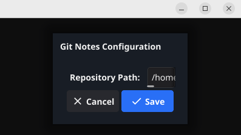

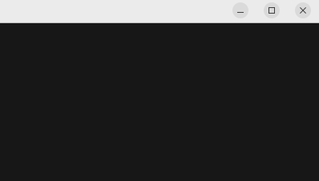

</details>

Closing it will generate ths following error:

```
panic: close of closed channel

goroutine 1 [running, locked to thread]:
fyne.io/fyne/v2/internal/driver/glfw.(*gLDriver).runGL(0x47a332?)
        /home/pablo/go/pkg/mod/fyne.io/fyne/v2@v2.5.4/internal/driver/glfw/loop.go:111 +0x4e
fyne.io/fyne/v2/internal/driver/glfw.(*gLDriver).Run(0xc000338b60)
        /home/pablo/go/pkg/mod/fyne.io/fyne/v2@v2.5.4/internal/driver/glfw/driver.go:164 +0x73
fyne.io/fyne/v2/app.(*fyneApp).Run(0xc00027d540)
        /home/pablo/go/pkg/mod/fyne.io/fyne/v2@v2.5.4/app/app.go:71 +0x65
fyne.io/fyne/v2/internal/driver/glfw.(*window).ShowAndRun(0xc000007dc0?)
        /home/pablo/go/pkg/mod/fyne.io/fyne/v2@v2.5.4/internal/driver/glfw/window.go:235 +0x22
main.main()
        /home/pablo/go/src/github.com/pablochacin/git-notes-app/v1/main.go:570 +0xfd8
```

### Fix the dialog not closing

I asked Claude the following

> Forget the last changes you suggested. I found the problem was a missing ShowAndRun call on the configuration dialog. This is now fixed. The dialog is shown, but after saving changes, the dialog remains open. Fix this problem.

### Response from Claude

I understand the issue now. The configuration dialog is being shown correctly, but it's not closing after saving the changes. Let's fix this specific problem in the createConfigFile function.

The issue is that after writing the configuration to the file, the dialog remains open because there's no code to close the window. In the current implementation, we're waiting for the dialog result using the done channel, but we need to explicitly close the window after processing the dialog result.

Here's how to fix it:

```golang
// createConfigFile creates a new configuration file with user input
func createConfigFile(homeDir, configPath string) (AppConfig, error) {
    config := AppConfig{}
    
    // Default repository path
    defaultRepoPath := filepath.Join(homeDir, "notes-repo")
    
    // Ask user for repository path using dialog
    a := app.New()
    w := a.NewWindow("Git Notes Configuration")
    w.Resize(fyne.NewSize(400, 200))
    
    // Entry for repository path
    repoPathEntry := widget.NewEntry()
    repoPathEntry.SetText(defaultRepoPath)
    
    // Form for the dialog
    form := &widget.Form{
        Items: []*widget.FormItem{
            {Text: "Repository Path:", Widget: repoPathEntry},
        },
    }
    
    // Channel to get the result
    done := make(chan bool)
    
    // Create and show dialog
    dialog.ShowCustomConfirm("Git Notes Configuration", "Save", "Cancel", form, func(save bool) {
        if save {
            config.RepoPath = repoPathEntry.Text
            
            // Write to config file
            configContent := fmt.Sprintf("REPO_PATH=%s\n", config.RepoPath)
            err := ioutil.WriteFile(configPath, []byte(configContent), 0644)
            if err != nil {
                dialog.ShowError(fmt.Errorf("failed to write config file: %v", err), w)
            }
        } else {
            // Use default if canceled
            config.RepoPath = defaultRepoPath
            
            // Write default to config file
            configContent := fmt.Sprintf("REPO_PATH=%s\n", config.RepoPath)
            err := ioutil.WriteFile(configPath, []byte(configContent), 0644)
            if err != nil {
                dialog.ShowError(fmt.Errorf("failed to write config file: %v", err), w)
            }
        }
        done <- true
    }, w)
    
    w.ShowAndRun() // This line shows the window, but blocks until window is closed
    
    <-done // Wait for dialog to complete
    w.Close()
    
    return config, nil
}
```

### fix black window Shown

After this changes, the black window still remained.
I asked the following to Claude.

> after clicking either save or cancel the configuration window is still open but shown nothing.

### Claude response

The issue is that we're trying to manually manage the window lifecycle when Fyne's dialog system already handles this. Let's simplify the approach and make it work properly.

The problem is in how we're handling the dialog completion. When using Fyne's built-in dialogs, we should let them manage their own lifecycle rather than trying to manually close windows.

Here's how to fix the createConfigFile function:

```golang
// createConfigFile creates a new configuration file with user input
func createConfigFile(homeDir, configPath string) (AppConfig, error) {
    config := AppConfig{}
    
    // Default repository path
    defaultRepoPath := filepath.Join(homeDir, "notes-repo")
    
    // Create a temporary app instance for configuration
    a := app.New()
    w := a.NewWindow("Git Notes Configuration")
    w.Resize(fyne.NewSize(400, 200))
    
    // Entry for repository path
    repoPathEntry := widget.NewEntry()
    repoPathEntry.SetText(defaultRepoPath)
    
    // Form for the dialog
    form := &widget.Form{
        Items: []*widget.FormItem{
            {Text: "Repository Path:", Widget: repoPathEntry},
        },
    }
    
    // Channel to get the result
    done := make(chan bool)
    
    // Create and show dialog
    dlg := dialog.NewCustomConfirm("Git Notes Configuration", "Save", "Cancel", form, func(save bool) {
        if save {
            config.RepoPath = repoPathEntry.Text
        } else {
            // Use default if canceled
            config.RepoPath = defaultRepoPath
        }
        
        // Write to config file regardless of which button was pressed
        configContent := fmt.Sprintf("REPO_PATH=%s\n", config.RepoPath)
        err := ioutil.WriteFile(configPath, []byte(configContent), 0644)
        if err != nil {
            // Show error dialog and don't signal completion yet
            errDlg := dialog.NewError(fmt.Errorf("failed to write config file: %v", err), w)
            errDlg.SetOnClosed(func() {
                // Now we can signal completion
                done <- true
            })
            errDlg.Show()
            return
        }
        
        // Signal completion directly if no error
        done <- true
    })
    
    // Show the dialog
    dlg.Show()
    
    // Wait for completion signal
    <-done
    
    // Explicitly quit the app
    a.Quit()
    
    return config, nil
}
```

### Review of the code

The code proposed by claude had multiple issues.

First it was creating again a new application, instead of using the application passed to the `createConfigFile`.

Also, there was a missing argument to the `NewCustomConfirm` method. I tried the changes but the problem of the application not been shown returned.

### Change approach reuse main application's window

Looking at the code, and the new `dlg.Show` call, I realized the problem was maybe that we didn't need a new window but to create a dialog on the main application's window.

> Forget the latest changes you suggested. I want to try something different: do not create a new window in the createConfigFile function. Instead, pass the window from the main function.

### Answer from Claude

That's a good approach that should simplify the application flow. Let's refactor the code to pass the window from the main function to the configuration process, which will help avoid issues with multiple windows and application instances.
Here's how we can modify the code:

1. First, let's update the createConfigFile function signature to accept a window parameter:

```golang
// createConfigFile creates a new configuration file with user input
func createConfigFile(homeDir, configPath string, w fyne.Window) (AppConfig, error) {
    config := AppConfig{}
    
    // Default repository path
    defaultRepoPath := filepath.Join(homeDir, "notes-repo")
    
    // Entry for repository path
    repoPathEntry := widget.NewEntry()
    repoPathEntry.SetText(defaultRepoPath)
    
    // Form for the dialog
    form := &widget.Form{
        Items: []*widget.FormItem{
            {Text: "Repository Path:", Widget: repoPathEntry},
        },
    }
    
    // Channel to get the result
    done := make(chan bool)
    
    // Create and show dialog using the window parameter
    dialog.ShowCustomConfirm("Git Notes Configuration", "Save", "Cancel", form, func(save bool) {
        if save {
            config.RepoPath = repoPathEntry.Text
            
            // Write to config file
            configContent := fmt.Sprintf("REPO_PATH=%s\n", config.RepoPath)
            err := ioutil.WriteFile(configPath, []byte(configContent), 0644)
            if err != nil {
                dialog.ShowError(fmt.Errorf("failed to write config file: %v", err), w)
            }
        } else {
            // Use default if canceled
            config.RepoPath = defaultRepoPath
            
            // Write default to config file
            configContent := fmt.Sprintf("REPO_PATH=%s\n", config.RepoPath)
            err := ioutil.WriteFile(configPath, []byte(configContent), 0644)
            if err != nil {
                dialog.ShowError(fmt.Errorf("failed to write config file: %v", err), w)
            }
        }
        done <- true
    }, w)
    
    <-done // Wait for dialog to complete
    
    return config, nil
}
```

2. Now, let's update the loadConfig function to also accept a window parameter:

```go
// loadConfig loads the configuration from .git-notes.conf file
func loadConfig(w fyne.Window) (AppConfig, error) {
    config := AppConfig{}
    homeDir, err := os.UserHomeDir()
    if err != nil {
        return config, fmt.Errorf("failed to get user home directory: %v", err)
    }

    configPath := filepath.Join(homeDir, ".git-notes.conf")
    
    // Check if config file exists
    if _, err := os.Stat(configPath); os.IsNotExist(err) {
        // Config file doesn't exist, create it
        return createConfigFile(homeDir, configPath, w)
    }
    
    // Read the config file
    content, err := ioutil.ReadFile(configPath)
    if err != nil {
        return config, fmt.Errorf("failed to read config file: %v", err)
    }
    
    // Parse config file
    lines := strings.Split(string(content), "\n")
    for _, line := range lines {
        line = strings.TrimSpace(line)
        if strings.HasPrefix(line, "REPO_PATH=") {
            config.RepoPath = strings.TrimPrefix(line, "REPO_PATH=")
        }
    }
    
    // Validate config
    if config.RepoPath == "" {
        return config, fmt.Errorf("repository path not found in config file")
    }
    
    return config, nil
}
```

3. Finally, let's update the main function to create the window first and pass it to loadConfig:

```go
func main() {
    // Create Fyne app
    a := app.New()
    a.Settings().SetTheme(theme.DarkTheme())
    
    // Create a temporary window for configuration if needed
    configWindow := a.NewWindow("Git Notes Configuration")
    configWindow.Resize(fyne.NewSize(400, 200))
    
    // Load configuration, passing the window
    config, err := loadConfig(configWindow)
    if err != nil {
        fmt.Printf("Error loading configuration: %v\n", err)
        os.Exit(1)
    }
    
    // Ensure repository exists
    repo, err := ensureRepoExists(config.RepoPath)
    if err != nil {
        fmt.Printf("Error initializing repository: %v\n", err)
        os.Exit(1)
    }
    
    // Create main application window
    w := a.NewWindow("Notes Manager")
    w.Resize(fyne.NewSize(900, 700))
    
    // Rest of your existing UI setup...
    // ...
    
    // Hide the config window if it was used
    configWindow.Hide()
    
    // Show and run the main window
    w.ShowAndRun()
}
```

This approach:

1. Creates a single application instance in main()
2. Creates a configuration window early on
3. Passes that window to the configuration functions
4. Hides the configuration window once main application starts
5. Shows the main application window

This should avoid the issues with multiple windows and ensure that the configuration dialog properly closes after it's done.

### Review of the code

The changes suggested by Claude did not solve the problem of the application not been shown.
I decided to revert the changes to a previous version, the one that showed a black window after closing the dialog.
I decided to ask Clauded to fix just this problem.

> Forget the latest changes you suggested. In the previous version of the code the only problem is that the window created in the createConfigFile function is shown after the dialog is closed. Fix only this problem.

### Claude Response

I understand the specific issue now. The problem is that after the dialog in createConfigFile is closed, the window is still being shown. Let's focus on fixing just this particular problem.

Here's the change we need to make to the createConfigFile function:

```golang
// createConfigFile creates a new configuration file with user input
func createConfigFile(homeDir, configPath string) (AppConfig, error) {
    config := AppConfig{}
    
    // Default repository path
    defaultRepoPath := filepath.Join(homeDir, "notes-repo")
    
    // Ask user for repository path using dialog
    a := app.New()
    w := a.NewWindow("Git Notes Configuration")
    w.Resize(fyne.NewSize(400, 200))
    
    // Entry for repository path
    repoPathEntry := widget.NewEntry()
    repoPathEntry.SetText(defaultRepoPath)
    
    // Form for the dialog
    form := &widget.Form{
        Items: []*widget.FormItem{
            {Text: "Repository Path:", Widget: repoPathEntry},
        },
    }
    
    // Channel to get the result
    done := make(chan bool)
    
    // Create and show dialog
    dialog.ShowCustomConfirm("Git Notes Configuration", "Save", "Cancel", form, func(save bool) {
        if save {
            config.RepoPath = repoPathEntry.Text
            
            // Write to config file
            configContent := fmt.Sprintf("REPO_PATH=%s\n", config.RepoPath)
            err := ioutil.WriteFile(configPath, []byte(configContent), 0644)
            if err != nil {
                dialog.ShowError(fmt.Errorf("failed to write config file: %v", err), w)
            }
        } else {
            // Use default if canceled
            config.RepoPath = defaultRepoPath
            
            // Write default to config file
            configContent := fmt.Sprintf("REPO_PATH=%s\n", config.RepoPath)
            err := ioutil.WriteFile(configPath, []byte(configContent), 0644)
            if err != nil {
                dialog.ShowError(fmt.Errorf("failed to write config file: %v", err), w)
            }
        }
        done <- true
    }, w)
    
    // Important: Only show the window, don't use ShowAndRun()
    w.Show()
    
    <-done // Wait for dialog to complete
    
    // Close the window and quit the app after the dialog is completed
    w.Close()
    a.Quit()
    
    return config, nil
}
```

The key changes are:

1. Using w.Show() instead of w.ShowAndRun() to allow the function to continue executing
2. After receiving the signal on the done channel (indicating the dialog has completed), explicitly calling w.Close() to close the window
3. Adding a.Quit() to ensure the temporary app instance is fully terminated

These changes ensure that the window is properly closed after the dialog completes, and the temporary app instance is properly terminated.

### Review of the code

Claude is turning to creating a new application inside the function, something that previously had not worked.
Also, I was suspicious of this explanation 

> Using w.Show() instead of w.ShowAndRun() to allow the function to continue executing

Without the `ShownAndRun` the application wil not process the events from the dialog.

#3 Try to understand the problem

After the many failed attempts to fix the application, I realized that the nature of the problem was beyond Claude's understanding not only of the fyne API but also the application's flow. In particular, it seemed to miss the fact that the `ShowAndRun` method was blocking and therefore the application would stop there.

Also, I realized the flow wasn't trivial, as the application had to pick the configuration using a dialog and then use this configuration to build the main application's window. But the configuration dialog won't work until the `ShowAndRun` method is called. Therefore, these two actions, loading the configuration and creating the main application's window must be executed in some asynchronous routines that communicate, for example using a channel.

These changes seemed non-trivial to try in the application, so I decided to try a different approach and ask Claude for an example application:

> 
show me an example of a golang application using the fyne library that opens a startup dialog asking for an input value before creating and displaying the main application's window. The main application's window requires the value obtained by the dialog.

### claude's response

```golang
package main

import (
	"fmt"

	"fyne.io/fyne/v2"
	"fyne.io/fyne/v2/app"
	"fyne.io/fyne/v2/container"
	"fyne.io/fyne/v2/dialog"
	"fyne.io/fyne/v2/layout"
	"fyne.io/fyne/v2/widget"
)

func main() {
	// Create a new Fyne application
	myApp := app.New()
	
	// Create a temporary window for the dialog
	// This window won't be shown, it's just a parent for the dialog
	tempWindow := myApp.NewWindow("Input")
	tempWindow.Resize(fyne.NewSize(400, 200))
	
	// Create an entry widget for user input
	entry := widget.NewEntry()
	entry.SetPlaceHolder("Enter your value here")
	
	// Channel to wait for the dialog result
	inputChan := make(chan string)
	
	// Create and show the custom dialog
	customDialog := dialog.NewCustom("Startup Input", "Submit", container.NewVBox(
		widget.NewLabel("Please enter a value to continue:"),
		entry,
	), tempWindow)
	
	// Add a submit button
	submitButton := widget.NewButton("Submit", func() {
		if entry.Text == "" {
			dialog.ShowInformation("Error", "Please enter a value", tempWindow)
			return
		}
		
		inputChan <- entry.Text
		customDialog.Hide()
	})
	
	// Update the dialog to use our custom buttons
	customDialog.SetButtons([]fyne.CanvasObject{
		submitButton,
	})
	
	// Show the dialog
	customDialog.Show()
	
	// Block until we get input
	inputValue := <-inputChan
	
	// Close the temporary window
	tempWindow.Close()
	
	// Create the main application window using the input value
	createMainWindow(myApp, inputValue)
	
	// Start the main event loop
	myApp.Run()
}

func createMainWindow(a fyne.App, inputValue string) {
	// Create the main window
	mainWindow := a.NewWindow("Main Application")
	mainWindow.Resize(fyne.NewSize(600, 400))
	
	// Create widgets for the main window
	welcomeLabel := widget.NewLabel(fmt.Sprintf("Welcome to the application!"))
	valueLabel := widget.NewLabel(fmt.Sprintf("You entered: %s", inputValue))
	
	// Example of how you might use the input value
	var contentWidget fyne.CanvasObject
	
	if len(inputValue) > 5 {
		contentWidget = widget.NewLabel("You entered a long value!")
	} else {
		contentWidget = widget.NewLabel("You entered a short value!")
	}
	
	// Create a button that uses the input value
	actionButton := widget.NewButton("Use Input Value", func() {
		dialog.ShowInformation("Input Value", 
			fmt.Sprintf("Using the value: %s", inputValue), 
			mainWindow)
	})
	
	// Set the content of the main window
	mainWindow.SetContent(container.NewVBox(
		welcomeLabel,
		valueLabel,
		contentWidget,
		layout.NewSpacer(),
		actionButton,
	))
	
	// Show the main window
	mainWindow.Show()
}
```

### Review of the code

This code had the same synchronization issues than the notes application. The `myApp.Run()` method won't be called because the application is waiting for the input value in `inputValue := <-inputChan` and the dialog won't be shown until the `myApp.Run()` method is called.

I tried to explain this to Claude and see if it could find a solution

> This code has a synchronization issue. The myApp.Run() method won't be called because the application is waiting for the input value in inputValue := <-inputChan that comes from the custom dialog, but the dialog won't be shown until the myApp.Run() method is called. These actions must be executed asynchronously.

### Claude response

You're absolutely right. I missed a critical issue with the synchronization in the code. The dialog won't be shown until the application's event loop starts with myApp.Run(), but the code blocks waiting for input from the channel before that happens.

Let me fix this with a properly implemented asynchronous approach:

```golang
package main

import (
	"fmt"

	"fyne.io/fyne/v2"
	"fyne.io/fyne/v2/app"
	"fyne.io/fyne/v2/container"
	"fyne.io/fyne/v2/dialog"
	"fyne.io/fyne/v2/layout"
	"fyne.io/fyne/v2/widget"
)

func main() {
	// Create a new Fyne application
	myApp := app.New()
	
	// Create a temporary window for the dialog
	// This window won't be shown, it's just a parent for the dialog
	tempWindow := myApp.NewWindow("Input")
	tempWindow.Resize(fyne.NewSize(400, 200))
	
	// Create an entry widget for user input
	entry := widget.NewEntry()
	entry.SetPlaceHolder("Enter your value here")
	
	// Create and show the custom dialog
	customDialog := dialog.NewCustom("Startup Input", "Submit", container.NewVBox(
		widget.NewLabel("Please enter a value to continue:"),
		entry,
	), tempWindow)
	
	// Add a submit button
	submitButton := widget.NewButton("Submit", func() {
		if entry.Text == "" {
			dialog.ShowInformation("Error", "Please enter a value", tempWindow)
			return
		}
		
		// Hide the dialog
		customDialog.Hide()
		
		// Close the temporary window
		tempWindow.Close()
		
		// Create the main application window using the input value
		createMainWindow(myApp, entry.Text)
	})
	
	// Update the dialog to use our custom buttons
	customDialog.SetButtons([]fyne.CanvasObject{
		submitButton,
	})
	
	// Show the dialog without blocking
	customDialog.Show()
	
	// Start the main event loop
	myApp.Run()
}

func createMainWindow(a fyne.App, inputValue string) {
	// Create the main window
	mainWindow := a.NewWindow("Main Application")
	mainWindow.Resize(fyne.NewSize(600, 400))
	
	// Create widgets for the main window
	welcomeLabel := widget.NewLabel(fmt.Sprintf("Welcome to the application!"))
	valueLabel := widget.NewLabel(fmt.Sprintf("You entered: %s", inputValue))
	
	// Example of how you might use the input value
	var contentWidget fyne.CanvasObject
	
	if len(inputValue) > 5 {
		contentWidget = widget.NewLabel("You entered a long value!")
	} else {
		contentWidget = widget.NewLabel("You entered a short value!")
	}
	
	// Create a button that uses the input value
	actionButton := widget.NewButton("Use Input Value", func() {
		dialog.ShowInformation("Input Value", 
			fmt.Sprintf("Using the value: %s", inputValue), 
			mainWindow)
	})
	
	// Set the content of the main window
	mainWindow.SetContent(container.NewVBox(
		welcomeLabel,
		valueLabel,
		contentWidget,
		layout.NewSpacer(),
		actionButton,
	))
	
	// Show the main window
	mainWindow.Show()
}
```

The key changes I made to fix the synchronization issue:

1. Removed the channel-based synchronization approach entirely.
2. Restructured the flow to be event-driven rather than sequential/blocking.
3. In the submit button's callback, I now:
* Hide and close the dialog
* Create the main window with the input value
* All this happens after the application's event loop has started

This way, the application starts its event loop with myApp.Run() immediately after showing the dialog. The dialog will be displayed, and when the user submits input, the callback function creates the main window with that input value.
This pattern follows the proper event-driven architecture that GUI applications like Fyne are designed to use, rather than trying to force a synchronous flow with channels.

### Code review

The code looked more likely to work, but nothing was shown. I realized the temporary window was not shown. I asked Claude to fix it

> 

### Claude's response:

You're right, let me examine this issue more carefully. The problem is that the temporary window isn't being shown, which means the dialog isn't visible.

```golang
package main

import (
	"fmt"

	"fyne.io/fyne/v2"
	"fyne.io/fyne/v2/app"
	"fyne.io/fyne/v2/container"
	"fyne.io/fyne/v2/dialog"
	"fyne.io/fyne/v2/layout"
	"fyne.io/fyne/v2/widget"
)

func main() {
	// Create a new Fyne application
	myApp := app.New()
	
	// Create a window for the dialog that will be shown
	dialogWindow := myApp.NewWindow("Input Required")
	dialogWindow.Resize(fyne.NewSize(400, 200))
	
	// This is critical - we need to show the window first
	dialogWindow.Show()
	
	// Create and configure the main window but don't show it yet
	mainWindow := myApp.NewWindow("Main Application")
	mainWindow.Resize(fyne.NewSize(600, 400))
	
	// We'll show a standard entry dialog instead of a custom one
	entryDialog := dialog.NewEntryDialog(
		"Startup Input",
		"Please enter a value to continue:",
		func(value string) {
			if value == "" {
				// Show an error dialog if the input is empty
				dialog.ShowInformation("Error", "Please enter a value", dialogWindow)
				
				// Show the entry dialog again
				entryDialog.Show()
				return
			}
			
			// We have a valid input, close the dialog window
			dialogWindow.Hide()
			
			// Create the main window content
			createMainWindowContent(mainWindow, value)
			
			// Show the main window
			mainWindow.Show()
		},
		dialogWindow,
	)
	
	// Set placeholder text
	entryDialog.SetPlaceholder("Enter your value here")
	
	// Show the entry dialog
	entryDialog.Show()
	
	// Start the application's event loop
	myApp.Run()
}

func createMainWindowContent(window fyne.Window, inputValue string) {
	// Create widgets for the main window
	welcomeLabel := widget.NewLabel("Welcome to the application!")
	valueLabel := widget.NewLabel(fmt.Sprintf("You entered: %s", inputValue))
	
	// Example of how you might use the input value
	var contentWidget fyne.CanvasObject
	
	if len(inputValue) > 5 {
		contentWidget = widget.NewLabel("You entered a long value!")
	} else {
		contentWidget = widget.NewLabel("You entered a short value!")
	}
	
	// Create a button that uses the input value
	actionButton := widget.NewButton("Use Input Value", func() {
		dialog.ShowInformation("Input Value", 
			fmt.Sprintf("Using the value: %s", inputValue), 
			window)
	})
	
	// Set the content of the main window
	window.SetContent(container.NewVBox(
		welcomeLabel,
		valueLabel,
		contentWidget,
		layout.NewSpacer(),
		actionButton,
	))
	
	// Set window close handler to quit the application
	window.SetOnClosed(func() {
		window.Canvas().Overlays().Top().Hide()
	})
}
```

I've made the following critical changes to fix the issue:

1 The primary problem was that we weren't calling dialogWindow.Show() to make the initial window visible. Now I explicitly show the dialog window.

2. I've also simplified the approach:
* Using Fyne's built-in NewEntryDialog instead of a custom dialog
* Creating the main window upfront but not showing it until we have input
* Only after getting valid input do we populate and show the main window

3. Better error handling:

*If the user submits empty input, we show an error and redisplay the dialog
* The dialog window is properly hidden once we have our input

4. Improved structure:

* Split the window creation and content population for better organization
* Added a window close handler to properly clean up overlays


This approach should properly display the startup dialog first, wait for input, and then show the main application window with the input value.

### Code review

Claude's code didn't compile.

```
./main.go:39:5: undefined: entryDialog
```

The problem is that the dialog's callback function was using the dialog variable, which is not yet created (there's sort of circular reference).

I asked claude to fix this error:

> Code does not compile. There's an "undefined: entryDialog error" in 
>// Show the entry dialog again entryDialog.Show()
>.undefined: entryDialog

### Claude's response

You're right, the variable entryDialog is undefined in that scope. The problem is that I'm trying to reference the dialog inside the callback function before it's been declared. Let me fix this immediately:

```golang
package main

import (
	"fmt"

	"fyne.io/fyne/v2"
	"fyne.io/fyne/v2/app"
	"fyne.io/fyne/v2/container"
	"fyne.io/fyne/v2/dialog"
	"fyne.io/fyne/v2/layout"
	"fyne.io/fyne/v2/widget"
)

func main() {
	// Create a new Fyne application
	myApp := app.New()
	
	// Create a window for the dialog that will be shown
	dialogWindow := myApp.NewWindow("Input Required")
	dialogWindow.Resize(fyne.NewSize(400, 200))
	
	// Create and configure the main window but don't show it yet
	mainWindow := myApp.NewWindow("Main Application")
	mainWindow.Resize(fyne.NewSize(600, 400))
	
	// Create an entry for user input
	entry := widget.NewEntry()
	entry.SetPlaceHolder("Enter your value here")
	
	// Show the dialog window
	dialogWindow.Show()
	
	// Define a function to handle when the user submits a valid input
	var showInputDialog func()
	
	processInput := func() {
		value := entry.Text
		if value == "" {
			// Show an error dialog if the input is empty
			dialog.ShowInformation("Error", "Please enter a value", dialogWindow)
			return
		}
		
		// We have a valid input, close the dialog window
		dialogWindow.Hide()
		
		// Create the main window content
		createMainWindowContent(mainWindow, value)
		
		// Show the main window
		mainWindow.Show()
	}
	
	// Create the submit button
	submitButton := widget.NewButton("Submit", processInput)
	
	// Create the content for the dialog window
	dialogContent := container.NewVBox(
		widget.NewLabel("Please enter a value to continue:"),
		entry,
		submitButton,
	)
	
	// Set the content of the dialog window
	dialogWindow.SetContent(dialogContent)
	
	// Make pressing Enter in the entry trigger the submit function
	entry.OnSubmitted = func(s string) {
		processInput()
	}
	
	// Start the application's event loop
	myApp.Run()
}

func createMainWindowContent(window fyne.Window, inputValue string) {
	// Create widgets for the main window
	welcomeLabel := widget.NewLabel("Welcome to the application!")
	valueLabel := widget.NewLabel(fmt.Sprintf("You entered: %s", inputValue))
	
	// Example of how you might use the input value
	var contentWidget fyne.CanvasObject
	
	if len(inputValue) > 5 {
		contentWidget = widget.NewLabel("You entered a long value!")
	} else {
		contentWidget = widget.NewLabel("You entered a short value!")
	}
	
	// Create a button that uses the input value
	actionButton := widget.NewButton("Use Input Value", func() {
		dialog.ShowInformation("Input Value", 
			fmt.Sprintf("Using the value: %s", inputValue), 
			window)
	})
	
	// Set the content of the main window
	window.SetContent(container.NewVBox(
		welcomeLabel,
		valueLabel,
		contentWidget,
		layout.NewSpacer(),
		actionButton,
	))
}
```

1. I've completely reworked the approach to fix the compilation error:

Instead of using Fyne's built-in dialog (which was causing the variable reference issue), I now create:

* A simple entry widget for input
* A submit button
* Custom dialog content with these components


2. I've simplified the flow:

* Create a dialog window and show it immediately
* When the user submits a valid input, hide the dialog window and show the main window
* Both pressing Enter in the entry field or clicking the Submit button will process the input


3. The processInput function handles input validation:

* If input is empty, it shows an error dialog but keeps the input window open
* If input is valid, it closes the dialog window and shows the main application window

This approach should now compile correctly and provide the functionality you need - a startup dialog asking for an input value before showing the main application window.

### Code Review

The code failed to compile with this error:
```
./main.go:34:6: showInputDialog declared and not used
```

Just removing this line fixed the problem. I asked Claude to fix it.

> The code fails with this error "showInputDialog declared and not used". Fix this but do not introduce more changes in the code if not necessary.


### Claude response

You're right. Let me fix the unused variable without changing anything else in the code unnecessarily:


I've simply removed the unused variable declaration:

```golang
goCopyvar showInputDialog func()
```

This was a leftover variable from a previous approach that I didn't completely remove. The rest of the code remains exactly the same and should now compile correctly.

### Code review

The code compiled and worked as expected. 

<details>
<summary> screenshots (click to expand) </summary>


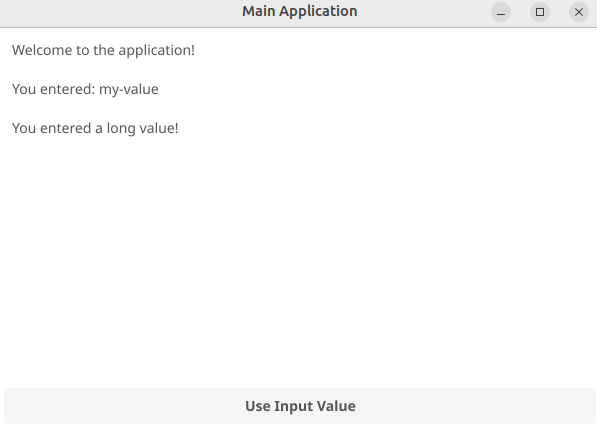
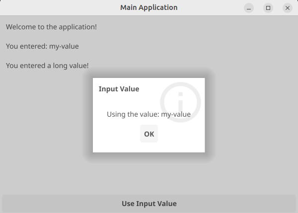

</details>

The only remaining issue was that after closing the main window, the application didn't exit. I asked Claude to fix this

> There's an issue. After closing the main window, the application didn't exit. Fix this error only.

### Claude's response

You're right. When the main window is closed, the application needs to exit properly. Let me fix that specific issue:

```golang
package main

import (
	"fmt"

	"fyne.io/fyne/v2"
	"fyne.io/fyne/v2/app"
	"fyne.io/fyne/v2/container"
	"fyne.io/fyne/v2/dialog"
	"fyne.io/fyne/v2/layout"
	"fyne.io/fyne/v2/widget"
)

func main() {
	// Create a new Fyne application
	myApp := app.New()
	
	// Create a window for the dialog that will be shown
	dialogWindow := myApp.NewWindow("Input Required")
	dialogWindow.Resize(fyne.NewSize(400, 200))
	
	// Create and configure the main window but don't show it yet
	mainWindow := myApp.NewWindow("Main Application")
	mainWindow.Resize(fyne.NewSize(600, 400))
	
	// Set the main window to quit the app when closed
	mainWindow.SetOnClosed(func() {
		myApp.Quit()
	})
	
	// Create an entry for user input
	entry := widget.NewEntry()
	entry.SetPlaceHolder("Enter your value here")
	
	// Show the dialog window
	dialogWindow.Show()
	
	// Define a function to handle when the user submits a valid input
	processInput := func() {
		value := entry.Text
		if value == "" {
			// Show an error dialog if the input is empty
			dialog.ShowInformation("Error", "Please enter a value", dialogWindow)
			return
		}
		
		// We have a valid input, close the dialog window
		dialogWindow.Hide()
		
		// Create the main window content
		createMainWindowContent(mainWindow, value)
		
		// Show the main window
		mainWindow.Show()
	}
	
	// Create the submit button
	submitButton := widget.NewButton("Submit", processInput)
	
	// Create the content for the dialog window
	dialogContent := container.NewVBox(
		widget.NewLabel("Please enter a value to continue:"),
		entry,
		submitButton,
	)
	
	// Set the content of the dialog window
	dialogWindow.SetContent(dialogContent)
	
	// Make pressing Enter in the entry trigger the submit function
	entry.OnSubmitted = func(s string) {
		processInput()
	}
	
	// Start the application's event loop
	myApp.Run()
}

func createMainWindowContent(window fyne.Window, inputValue string) {
	// Create widgets for the main window
	welcomeLabel := widget.NewLabel("Welcome to the application!")
	valueLabel := widget.NewLabel(fmt.Sprintf("You entered: %s", inputValue))
	
	// Example of how you might use the input value
	var contentWidget fyne.CanvasObject
	
	if len(inputValue) > 5 {
		contentWidget = widget.NewLabel("You entered a long value!")
	} else {
		contentWidget = widget.NewLabel("You entered a short value!")
	}
	
	// Create a button that uses the input value
	actionButton := widget.NewButton("Use Input Value", func() {
		dialog.ShowInformation("Input Value", 
			fmt.Sprintf("Using the value: %s", inputValue), 
			window)
	})
	
	// Set the content of the main window
	window.SetContent(container.NewVBox(
		welcomeLabel,
		valueLabel,
		contentWidget,
		layout.NewSpacer(),
		actionButton,
	))
}
```

I've added a single important fix

Set the main window to quit the app when closed
```golang
mainWindow.SetOnClosed(func() {
    myApp.Quit()
})
```
This ensures that when the main window is closed, the application properly exits by calling myApp.Quit(). The rest of the code remains unchanged.

This is a common requirement in GUI applications - the main window's close button should terminate the application rather than just hiding the window.

### Code review

The code worked and fixed all issues

### Final thoughts on the example application

Using a simpler application to explore the issues with the main notes application was helpful.

I also noticed that Claude tends to introduce optimizations even if not asked. That's some times useful as it simplifies the code, but also makes harder to follow the changes, even when it explains them with detail.

